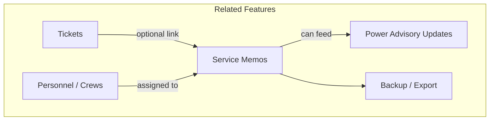

# Service Memo Feature - Context & Implementation Guide

**Status:** Planned (deferred until Power Advisory Updates and other core features are complete)  
**Created:** March 2026  
**Purpose:** Preserve context and design decisions for future implementation

---

## Power Advisory: Interim Remarks (Not Service Memos)

**As of March 2026:** The Power Advisory edit modal uses **Remarks** (optional) instead of Service Memos. Remarks are stored in `aleco_interruption_updates` and are optional—no remark is required to mark an advisory as Resolved. The full **Service Memo** feature will be implemented separately and will cover all features (tickets, interruptions, etc.), not just power advisories. See this document for the full Service Memo design.

---

## Recommendation: Implement After Core Features

**Finish these first:**
1. Power Advisory Updates (InterruptionList, Create Post, `aleco_interruptions` table)
2. Any other hardcoded placeholders

**Then implement Service Memos.** They can optionally feed into Power Advisory Updates (e.g., "Scheduled maintenance in Bitano 37" becomes a public advisory).

---

## What Is a Service Memo?

A **service memo** is an internal document that records work performed by field crews. Unlike tickets (which are consumer-initiated outage reports), service memos are:

- **Internal** – office ↔ field communication, not consumer-facing
- **Proactive or planned** – scheduled maintenance, inspections, meter work, new connections
- **Documentation** – record of work done, findings, and actions taken
- **Audit/compliance** – proof of work for regulators and internal review

### Example Use Cases

- "Scheduled maintenance on Bitano 37 feeder – completed."
- "Meter inspection at [address] – no issues."
- "New service connection – energized."
- "Line patrol – found and documented defect at pole #123."
- "Ticket TKT-20260316-0042 – replaced damaged insulator, power restored."

---

## Tickets vs Service Memos

| Aspect | Tickets | Service Memos |
|--------|----------|---------------|
| **Trigger** | Consumer reports problem | Staff creates (planned or after work) |
| **Direction** | Consumer → ALECO | Internal (field ↔ office) |
| **Purpose** | Fix outage, restore power | Document work, compliance, planning |
| **Urgency** | Often urgent | Often planned |
| **Customer visibility** | Yes (tracking) | Usually no |
| **Status flow** | Pending → Ongoing → Restored | Draft → Submitted → Filed |

---

## Why ALECO Needs Service Memos

1. **Compliance & audit trail** – Regulators ask "what work was done?" Tickets show what was reported; memos show what was actually done.
2. **Operational visibility** – Management can see maintenance, inspections, patrols, not just outage tickets.
3. **Planning & reporting** – Data for resource planning, budget justification, performance reports.
4. **Completes the Power Information System** – Consumer reports + planned advisories + field work documentation.

---

## Feature Relationships



| Feature | Relation |
|---------|----------|
| **Tickets** | Optional link when work is tied to an outage |
| **Personnel / Crews** | Memos record which crew did the work |
| **Power Advisory Updates** | Memos can document scheduled maintenance that becomes a public advisory |
| **Backup / History** | Memos included in audit trail and export |

---

## Proposed Implementation Scope

### Phase 1: Core Memos

- **Types:** Maintenance, Inspection, Line Patrol, New Connection
- **Fields:** Memo ID, type, date, location, crew, description, findings, status
- **Optional link:** To a ticket (e.g., when closing an outage)
- **Who creates:** Dispatchers, linemen, office staff
- **Visibility:** Internal only (admin dashboard)

### Phase 2: Integration

- Link memos to tickets when closing
- Include memos in backup/export
- Add memo history to audit trail

### Phase 3: Advisory Link

- When a memo is "Scheduled Maintenance" in an area, allow creating a Power Advisory from it

---

## Suggested Database Schema (Draft)

```sql
CREATE TABLE aleco_service_memos (
    id INT AUTO_INCREMENT PRIMARY KEY,
    memo_id VARCHAR(30) UNIQUE NOT NULL COMMENT 'Format: SM-YYYYMMDD-XXXX',
    type ENUM('Maintenance', 'Inspection', 'Line Patrol', 'New Connection', 'Other') NOT NULL,
    work_date DATE NOT NULL,
    location VARCHAR(255),
    district VARCHAR(255),
    municipality VARCHAR(255),
    assigned_crew_id INT,
    description TEXT,
    findings TEXT,
    status ENUM('Draft', 'Submitted', 'Filed') DEFAULT 'Draft',
    linked_ticket_id VARCHAR(20) COMMENT 'Optional FK to aleco_tickets.ticket_id',
    created_by INT,
    created_at DATETIME DEFAULT CURRENT_TIMESTAMP,
    updated_at DATETIME DEFAULT CURRENT_TIMESTAMP ON UPDATE CURRENT_TIMESTAMP,
    INDEX idx_memo_id (memo_id),
    INDEX idx_work_date (work_date),
    INDEX idx_type (type),
    INDEX idx_linked_ticket (linked_ticket_id)
);
```

---

## Suggested API Endpoints (Draft)

| Method | Endpoint | Purpose |
|--------|----------|---------|
| GET | `/api/service-memos` | List memos (with filters) |
| GET | `/api/service-memos/:memoId` | Get single memo |
| POST | `/api/service-memos` | Create memo |
| PUT | `/api/service-memos/:memoId` | Update memo |
| PUT | `/api/service-memos/:memoId/submit` | Submit (Draft → Submitted) |
| GET | `/api/service-memos/by-ticket/:ticketId` | Memos linked to a ticket |

---

## Admin UI Considerations

- **Sidebar:** Add "Service Memos" menu item (under Tickets or Personnel)
- **List view:** Table/grid with filters (date range, type, crew, status)
- **Create/Edit form:** Type, date, location, crew dropdown, description, findings, optional ticket link
- **Detail view:** Full memo with linked ticket (if any)

---

## Design Decisions to Confirm Before Implementation

1. **Who creates memos?** Field crews only, or also office staff?
2. **Memo types?** Final list: Maintenance, Inspection, Patrol, New Connection, Other?
3. **Ticket link:** Optional or required when closing a ticket?
4. **Visibility:** Internal only, or some info shown to consumers?
5. **Integration with Power Advisory Updates:** Auto-create advisory from memo, or manual?

---

## References

- Main docs: `ALECO_PIS_COMPLETE_DOCUMENTATION.md`
- Ticket schema: `aleco_tickets` table
- Personnel: `aleco_personnel`, `aleco_linemen_pool`
- Quick reference: `CURSOR_QUICK_REFERENCE.md`

---

*When ready to implement, return to this document and use it as the specification for the Service Memo feature.*
