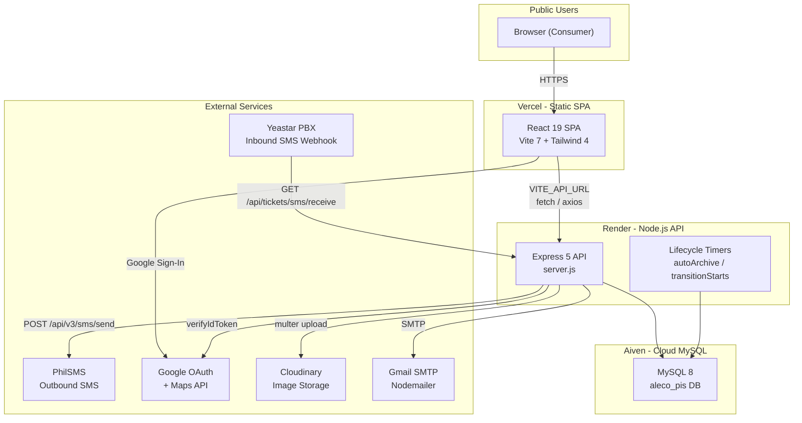
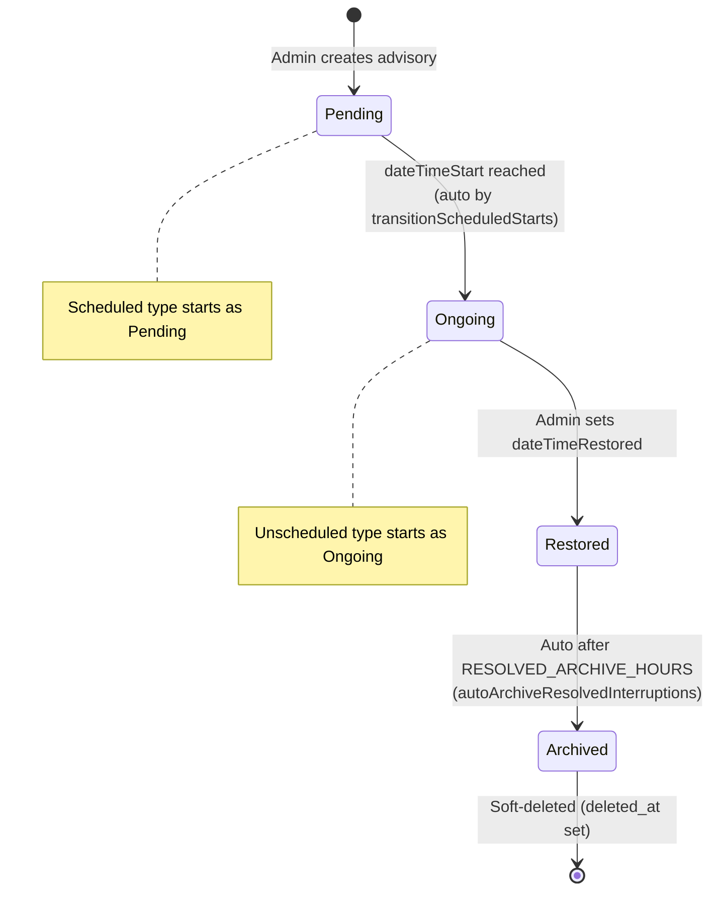
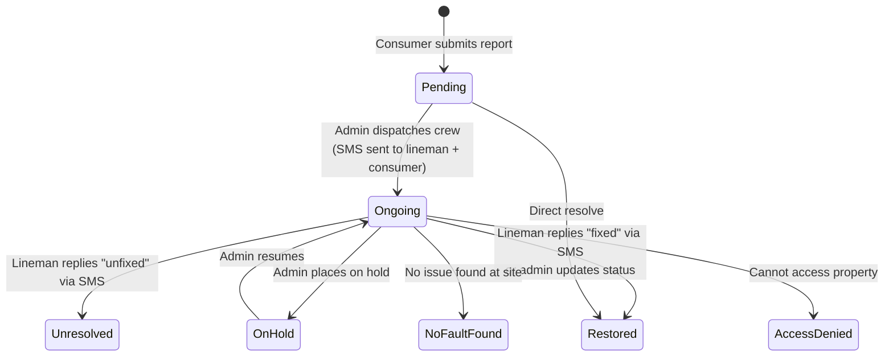
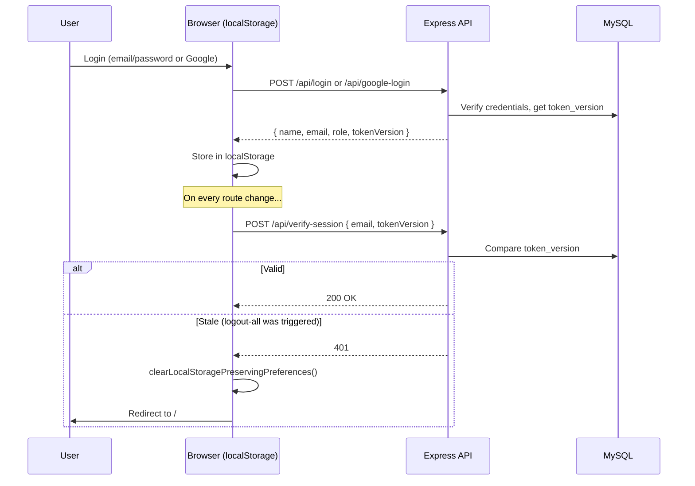

# SYSTEM_MANIFEST.md -- ALECO PIS System Source of Truth

> **Purpose:** This document is the single canonical reference for any developer or AI agent working on the ALECO PIS codebase. It documents architecture, data flows, dependencies, fragile zones, database schema, deployment, and UI design tokens. Every claim is backed by a file path.
>
> **Last updated:** April 2026 | **Codebase:** `aleco-pis@0.0.0` (monorepo, `"type": "module"`)

---

## Table of Contents

1. [High-Level Architecture](#1-high-level-architecture)
2. [Core System Flow](#2-core-system-flow)
3. [Folder and Modular Structure](#3-folder-and-modular-structure)
4. [Fragile Zones](#4-fragile-zones-critical)
5. [Backend and Database Schema](#5-backend-and-database-schema)
6. [Deployment and CI/CD](#6-deployment-and-cicd)
7. [UI/UX Design Tokens](#7-uiux-design-tokens)

---

## 1. High-Level Architecture

### 1.1 Mental Model

ALECO PIS (Public Information System) is a **public-facing outage portal + internal admin system** built for **Albay Electric Cooperative (ALECO)**. It serves two audiences:

- **Public consumers** visit the home page to see real-time power advisory bulletins (brownout/outage notices) in a Facebook-style vertical feed, report electrical problems via a form (with GPS and photo), and look up ALECO hotlines.
- **Admin dispatchers** log in to manage trouble tickets (dispatch crews via SMS, track resolution), create/edit power advisories, manage personnel (crews and linemen), view analytics dashboards, handle user accounts, and export/import data.

The system is **event-driven around two core entities**: **Power Advisories** (planned/unplanned outages with lifecycle states) and **Trouble Tickets** (consumer reports that get dispatched to field crews via SMS).

### 1.2 Tech Stack

| Layer | Technology | Version | Why |
|-------|-----------|---------|-----|
| **Frontend framework** | React | 19.2 | Component model, hooks, large ecosystem |
| **Build tool** | Vite | 7.3 | Fast HMR, ESM-native, simpler than Webpack |
| **CSS framework** | Tailwind CSS | 4.1 | Utility-first; v4 uses `@tailwindcss/vite` plugin (no `tailwind.config.js`) |
| **Routing** | React Router DOM | 7.13 | Client-side SPA routing, `BrowserRouter` |
| **Backend** | Express | 5.2 | Minimal Node.js HTTP framework; v5 for async route handlers |
| **Database** | MySQL on Aiven | mysql2 3.17 | Managed cloud MySQL; `mysql2/promise` connection pool |
| **Auth** | Google OAuth + localStorage | @react-oauth/google, google-auth-library | Google Sign-In for admin; invite-code + password as fallback; `token_version` invalidation (no JWT cookies) |
| **Outbound SMS** | PhilSMS REST API | axios | Chosen over Twilio for Philippine carrier coverage and cost; Twilio is in `package.json` but **unused in code** |
| **Inbound SMS** | Yeastar webhook | Express GET route | PBX-style query-param webhook at `GET /api/tickets/sms/receive` |
| **Email** | Nodemailer (Gmail SMTP) | 8.0 | Password resets, ticket copies, user invitations |
| **Image storage** | Cloudinary | 1.41 + multer-storage-cloudinary | Ticket and advisory image uploads to `aleco_reports` folder |
| **Charts** | Recharts | 3.7 | Dashboard analytics visualizations |
| **Maps** | Leaflet + react-leaflet | 1.9 / 5.0 | Coverage map, location preview on tickets |
| **Drag & drop** | @dnd-kit | core 6.3, sortable 10.0 | Kanban board column reordering |
| **Date handling** | dayjs + date-fns | 1.11 / 4.1 | Philippine timezone formatting (`Asia/Manila`), relative times |
| **Spreadsheets** | ExcelJS + csv-parse/csv-stringify | 4.4 / 6.x | Backup export/import in `.xlsx` and `.csv` |
| **Virtualization** | react-window | 2.2 | Large ticket list rendering (windowed grid) |
| **Toast notifications** | react-toastify | 11.0 | User feedback popups |
| **Frontend hosting** | Vercel | -- | Static SPA deployment (`vite build` -> `dist/`) |
| **Backend hosting** | Render | -- | Node.js web service (`node server.js`) |

### 1.3 Architecture Diagram



### 1.4 Key Monorepo Fact

This is a **single `package.json` monorepo**. Frontend and backend dependencies share one lockfile. The same repo root contains:
- `server.js` -- Express API entry point (backend)
- `src/` -- React SPA source (frontend)
- `backend/` -- Route modules, DB config, services, utils, migrations

There is **no** `backend/package.json`. All dependencies (React, Express, mysql2, etc.) are in the root `package.json`.

---

## 2. Core System Flow

### 2.1 Power Advisory Lifecycle

An advisory represents a power interruption (brownout). It flows through these states:



**Key files:**
- Creation/edit: [`backend/routes/interruptions.js`](backend/routes/interruptions.js) -- `POST /api/interruptions`, `PUT /api/interruptions/:id`
- Lifecycle timers: [`backend/services/interruptionLifecycle.js`](backend/services/interruptionLifecycle.js) -- `transitionScheduledStarts()` runs every 60s, `autoArchiveResolvedInterruptions()` every 5min (both started in [`server.js`](server.js) lines 147-161)
- Public feed: [`src/InterruptionList.jsx`](src/InterruptionList.jsx) -- filters out `deletedAt` and expired resolved items
- Feed polling: [`src/hooks/usePublicInterruptions.js`](src/hooks/usePublicInterruptions.js) -- polls `GET /api/interruptions?limit=50` every 30s (10s when items are pending transition)
- Admin CRUD: [`src/components/Interruptions.jsx`](src/components/Interruptions.jsx) + [`src/hooks/useAdminInterruptions.js`](src/hooks/useAdminInterruptions.js)

**Bulletin scheduling:** An advisory with `public_visible_at` set to a future time is hidden from the public feed until that time. Unscheduled advisories (`type = 'Unscheduled'`) are published immediately.

**Feed-pull / feed-push:** Admins can pull an advisory from the public feed (`PATCH /api/interruptions/:id/pull-from-feed`, sets `pulled_from_feed_at`) or push it back (`PATCH /api/interruptions/:id/push-to-feed`).

### 2.2 Trouble Ticket Lifecycle

A ticket represents a consumer's electrical problem report:



**Key files:**
- Public submission: [`src/ReportaProblem.jsx`](src/ReportaProblem.jsx) -- form with GPS, photo upload, phone validation
- Backend intake: [`backend/routes/tickets.js`](backend/routes/tickets.js) -- `POST /api/tickets/submit`
- Dispatch (SMS): Same file -- `PUT /api/tickets/:ticket_id/dispatch` calls `sendPhilSMS()` from [`backend/utils/sms.js`](backend/utils/sms.js)
- Inbound SMS: Same file -- `GET /api/tickets/sms/receive` (Yeastar webhook parses keyword replies like "fixed", "unfixed")
- Admin UI: [`src/components/Tickets.jsx`](src/components/Tickets.jsx), ticket detail pane, filter/sort/kanban views
- Ticket grouping: [`backend/routes/ticket-grouping.js`](backend/routes/ticket-grouping.js) -- groups similar tickets under a `GROUP-YYYYMMDD-XXXX` ID

### 2.3 Authentication and Session Model

There is **no server-side session store or JWT**. The system uses **localStorage + `token_version` validation**:



**Key files:**
- Login UI: [`src/components/buttons/login.jsx`](src/components/buttons/login.jsx) -- modal with email/password, Google, setup, forgot password
- Session check: [`src/App.jsx`](src/App.jsx) lines 36-64 -- `NavigationWrapper` runs `verifySession()` on every `location.pathname` change
- Backend auth: [`backend/routes/auth.js`](backend/routes/auth.js) -- `POST /api/login`, `/api/google-login`, `/api/verify-session`, `/api/logout-all` (bumps `token_version`)
- Google token verify: [`backend/utils/verifyGoogleIdToken.js`](backend/utils/verifyGoogleIdToken.js)
- Invite-code setup: `POST /api/setup-account` -- new users must have a valid `access_codes` entry

**Permissions model:** There is **no middleware-level RBAC**. Admin routes are protected only by:
1. Client-side: `/admin-*` routes check `localStorage.getItem('userEmail')` exists
2. Server-side: `POST /api/verify-session` validates `token_version`
3. API endpoints themselves are **open** (no per-route auth middleware) -- this is a documented known gap

User roles stored in `users.role` (values: `customer`, `admin`, etc.) but enforcement is client-side only.

---

## 3. Folder and Modular Structure

### 3.1 Directory Map

```
ALECO_PIS/
├── server.js                    # Express entry: CORS, route mounts, lifecycle timers
├── package.json                 # Single monorepo deps (frontend + backend)
├── vite.config.js               # Vite + Tailwind plugin + React plugin
├── index.html                   # SPA shell, loads /src/main.jsx
├── .env / .env.example          # Environment variables
├── cloudinaryConfig.js          # Cloudinary + multer-storage setup
├── alecoScope.js                # ALECO geographic scope data (districts/municipalities)
├── geocoder.js                  # Google Geocoding helper (standalone)
├── eslint.config.js             # ESLint flat config
│
├── src/                         # ── FRONTEND (React SPA) ──
│   ├── main.jsx                 # Entry: GoogleOAuthProvider, LoadingProvider, App
│   ├── App.jsx                  # Router, session verification, layout switching
│   ├── index.css                # Tailwind directives, CSS variables, theme tokens
│   ├── Navbar.jsx               # Top navigation bar (public pages)
│   ├── Footer.jsx               # Public page footer
│   ├── InterruptionList.jsx     # Public power advisory feed (home page)
│   ├── ReportaProblem.jsx       # Public trouble report form
│   ├── Dashboard.jsx            # Admin dashboard with analytics
│   ├── About.jsx                # About ALECO section
│   ├── PrivacyNotice.jsx        # Privacy notice section
│   │
│   ├── components/              # Feature components (99 .jsx files)
│   │   ├── AdminLayout.jsx      # Admin shell: sidebar + main content
│   │   ├── Sidebar.jsx          # Admin sidebar navigation
│   │   ├── Tickets.jsx          # Admin tickets page (orchestrator)
│   │   ├── Interruptions.jsx    # Admin power advisories page
│   │   ├── Users.jsx            # Admin user management
│   │   ├── PersonnelManagement.jsx  # Personnel (crews + linemen)
│   │   ├── History.jsx          # Ticket history logs
│   │   ├── Backup.jsx           # Data management (export/import/archive)
│   │   ├── CoverageMap.jsx      # Leaflet coverage map
│   │   ├── CookieBanner.jsx     # GDPR-style cookie consent
│   │   │
│   │   ├── interruptions/       # 21 files: advisory cards, forms, modals, feed posts
│   │   ├── tickets/             # 23 files: detail pane, filters, kanban, modals
│   │   ├── personnels/          # 7 files: crew/lineman grids, modals, cards
│   │   ├── users/               # 2 files: account action modal, layout picker
│   │   ├── backup/              # 13 files: export/import views, entity picker
│   │   ├── containers/          # 7 files: AllUsers, UrgentTickets, RecentOpened*
│   │   ├── buttons/             # Login, dark/light toggle, create post, map btn
│   │   ├── headers/             # Landing page header strip
│   │   ├── textfields/          # Phone input, explain problem, text fields
│   │   ├── dropdowns/           # ALECO scope dropdown, issue category
│   │   ├── searchBars/          # Global search bar (admin)
│   │   ├── contact/             # Hotlines display
│   │   ├── profile/             # Profile page
│   │   └── buckets/             # Upload component
│   │
│   ├── CSS/                     # 73 feature CSS files (BEM-ish, modular scale)
│   │   ├── *UIScale.css         # Responsive modular scaling per page
│   │   ├── *ModalUIScale.css    # Modal-specific scaling overrides
│   │   ├── *LayoutPicker.css    # View mode switcher styles
│   │   ├── InterruptionFeed.css # Facebook-style public feed
│   │   ├── BodyLandPage.css     # Public landing page
│   │   └── AdminPageLayout.css  # Admin chrome layout
│   │
│   ├── config/                  # 3 files
│   │   ├── apiBase.js           # getApiBaseUrl() -- VITE_API_URL resolution
│   │   ├── dateTimeConfig.js    # PH_TIMEZONE, PH_OFFSET_HOURS, PH_LOCALE
│   │   └── feederConfig.js      # FEEDER_AREAS mapping for advisory forms
│   │
│   ├── context/                 # React Context providers
│   │   ├── ThemeContext.jsx     # data-theme toggle (light/dark)
│   │   └── LoadingContext.jsx   # Global loading overlay state
│   │
│   ├── hooks/                   # 4 shared hooks
│   │   ├── useMatchMedia.js     # window.matchMedia subscription
│   │   ├── useNow.js            # Ticking "now" for countdown/status transitions
│   │   ├── usePublicInterruptions.js  # Public advisory list with polling
│   │   └── useAdminInterruptions.js   # Admin advisory CRUD API wrappers
│   │
│   ├── utils/                   # 20 utility files
│   │   ├── api.js               # apiUrl(path) = getApiBaseUrl() + path
│   │   ├── phoneUtils.js        # PH mobile validation/formatting
│   │   ├── dateUtils.js         # PH time formatting via dayjs
│   │   ├── interruptionFormUtils.js   # Advisory form state, mapping to API
│   │   ├── interruptionLabels.js      # Status/type/cause labels and select options
│   │   ├── kanbanHelpers.js           # Ticket kanban grouping/sorting
│   │   ├── ticketSelection.js         # Bulk selection helpers
│   │   ├── personnelStatusClass.js    # Personnel status slug/label
│   │   ├── useTickets.js              # Hook: fetch tickets with filters (axios)
│   │   ├── useRecentOpenedAdvisories.js  # Hook: recent advisories
│   │   ├── useRecentOpenedTickets.js     # Hook: recent tickets
│   │   └── ... (9 more)
│   │
│   ├── api/                     # API client config
│   │   ├── axiosConfig.js       # Axios instance with baseURL, global loader events
│   │   └── interruptionsApi.js  # listInterruptions() via fetch + apiUrl
│   │
│   └── constants/               # Shared constants
│       ├── interruptionConstants.js  # RESOLVED_DISPLAY_MS, etc.
│       └── dataManagementEntities.js # Entity labels for backup module
│
├── backend/                     # ── BACKEND (Express route modules) ──
│   ├── config/
│   │   ├── db.js                # mysql2/promise pool (Aiven SSL)
│   │   └── corsOrigins.js       # buildAllowedCorsOrigins(), normalizeOrigin()
│   │
│   ├── routes/                  # 8 route modules (mounted on /api in server.js)
│   │   ├── auth.js              # Login, Google login, setup, password reset, verify-session
│   │   ├── tickets.js           # Ticket CRUD, dispatch, SMS webhook, crews/pool CRUD
│   │   ├── ticket-routes.js     # GET /filtered-tickets (admin filter)
│   │   ├── ticket-grouping.js   # Ticket grouping system (GROUP-* IDs)
│   │   ├── interruptions.js     # Advisory CRUD, archive, feed pull/push, updates
│   │   ├── user.js              # User management, invite, profile, toggle status
│   │   ├── backup.js            # Export/import/archive for tickets, interruptions, users, personnel
│   │   └── contact-numbers.js   # GET /contact-numbers (public hotlines)
│   │
│   ├── services/
│   │   └── interruptionLifecycle.js  # Scheduled transitions, auto-archive, update helpers
│   │
│   ├── utils/
│   │   ├── sms.js               # sendPhilSMS() -- PhilSMS REST integration
│   │   ├── phoneUtils.js        # normalizePhoneForSMS(), validation (backend copy)
│   │   ├── dateTimeUtils.js     # nowPhilippineForMysql(), formatDateForDb()
│   │   ├── ticketDto.js         # Ticket row-to-DTO mapping
│   │   ├── interruptionsDto.js  # Interruption row-to-DTO mapping
│   │   ├── interruptionsDbSupport.js  # Shared SQL query helpers
│   │   ├── ticketLogHelper.js   # Audit log insertion
│   │   └── verifyGoogleIdToken.js  # google-auth-library verify
│   │
│   ├── constants/
│   │   └── interruptionConstants.js  # RESOLVED_ARCHIVE_HOURS, etc.
│   │
│   ├── migrations/              # 21 SQL files (manual, run via run-migration.js)
│   │   ├── create_aleco_interruptions.sql
│   │   ├── create_ticket_grouping_tables.sql
│   │   ├── create_contact_numbers.sql
│   │   ├── create_aleco_interruption_updates.sql
│   │   ├── add_facebook_style_interruptions.sql
│   │   ├── add_deleted_at_*.sql (2 files)
│   │   ├── add_hold_columns.sql
│   │   ├── add_dispatched_at.sql
│   │   └── ... (12 more ALTER/ADD migrations)
│   │
│   └── run-migration.js         # CLI: reads SQL file, splits on ;, executes against pool
│
├── docs/                        # 14 architecture/scan markdown files
│   ├── FULL_CODEBASE_MAP.md
│   ├── FULL_DATABASE_SCHEME_MARCH20.MD
│   ├── BACKEND_SERVER_FLOW.md
│   ├── ENV_AND_DEPLOYMENT_PRINCIPLES.md
│   ├── DEPLOYMENT_VERCEL_RENDER.md
│   ├── MODULAR_SCALE_AND_DESIGN_PATTERNS.md
│   ├── TICKET_FLOW_SCAN.md
│   ├── USER_AUTH_SCAN.md
│   ├── DATA_MANAGEMENT_SCAN.md
│   ├── PERSONNEL_HISTORY_SCAN.md
│   ├── LOCATION_PHONE_SMS_API_SCAN.md
│   ├── LOCAL_VS_DEPLOYED_RISKS.md
│   ├── TICKETS_ANALYSIS_AND_TRACKING.md
│   └── README.md (docs index)
│
├── public/                      # Static assets
│   ├── robots.txt
│   ├── sitemap.xml
│   └── vite.svg
│
└── .cursor/                     # Cursor IDE rules
    └── rules/
        ├── pre-edit-discovery.mdc
        └── deployment-env-host-agnostic.mdc
```

### 3.2 The "Lego Brick" Methodology

The codebase follows a pattern called "Lego Bricks" (referenced throughout `server.js` comments and docs):

- **Each feature** is a self-contained brick: React component(s) + CSS file(s) + optional hook + backend route module
- **Backend routes** are standalone Express Router modules mounted in `server.js` under `/api`
- **No shared ORM or model layer** -- SQL is written directly in route handlers (thick controllers)
- **DTOs** in `backend/utils/` map raw SQL rows to API response shapes
- **CSS is per-feature**, not global utility classes (despite Tailwind being available, most styling is hand-written CSS with custom properties)

### 3.3 Adding a New Feature

1. **Backend route:** Create `backend/routes/myFeature.js` with an Express Router
2. **Mount in server.js:** Add `import` and `app.use('/api', myFeatureRoutes)` -- **order matters** (see Section 4)
3. **Database:** Write a migration SQL file in `backend/migrations/`, run via `node backend/run-migration.js backend/migrations/myFile.sql`
4. **Frontend component:** Create `src/components/myFeature/` directory with `.jsx` files
5. **CSS:** Create `src/CSS/MyFeature.css`, import it in the component
6. **Modular scale:** If the feature needs responsive scaling, create `src/CSS/MyFeatureUIScale.css` with a `--myfeature-ui-scale` custom property following the viewport tier pattern (see Section 7)
7. **Route:** Add a `<Route path="/admin-myfeature" element={...} />` in `src/App.jsx`
8. **Sidebar link:** Add entry in `src/components/Sidebar.jsx`

---

## 4. Fragile Zones (CRITICAL)

These are areas where a seemingly small change can break the system. Every AI agent or developer must read this section before making modifications.

### 4.1 Express Router Mount Order

**File:** [`server.js`](server.js) lines 63-70

```
app.use('/api', authRoutes);
app.use('/api', backupRoutes);      // MUST be before ticketRoutes
app.use('/api', ticketRoutes);
app.use('/api', userRoutes);
app.use('/api', ticketFilterRoutes);
app.use('/api', ticketGroupingRoutes);
app.use('/api', interruptionsRoutes);
app.use('/api', contactNumbersRoutes);
```

**Why it matters:** `backupRoutes` defines `GET /tickets/export` and `POST /tickets/archive`. If `ticketRoutes` (which has `GET /tickets/:ticketId`) is mounted first, Express matches `/tickets/export` as `ticketId = "export"` and the backup endpoints become unreachable.

**Rule:** Never reorder route mounts without checking for path conflicts between static segments and `:param` wildcards.

### 4.2 VITE_* Build-Time Inlining

**Files:** [`src/config/apiBase.js`](src/config/apiBase.js), [`.env.example`](.env.example)

All `import.meta.env.VITE_*` values are **inlined at Vite build time**. Changing `VITE_API_URL` on the server has **no effect** on an already-built frontend. You must **rebuild and redeploy** the frontend (Vercel) whenever these change.

`getApiBaseUrl()` **throws** in production if neither `VITE_API_URL` nor `VITE_API_URL_PRODUCTION` is set -- this is intentional to prevent shipping a broken build.

### 4.3 CSS Modular Scale Variable Chains

**Files:** `src/CSS/*UIScale.css`, `src/CSS/*ModalUIScale.css`, `src/CSS/PersonnelGrid.css`

The system uses deeply nested CSS custom property chains:

```
--personnel-ui-scale  (page-level, set per viewport breakpoint)
  └─> --pg-card-scale = min(var(--personnel-ui-scale, 1), 0.65)  (card-level)
        └─> calc(0.82rem * var(--pg-card-scale, var(--personnel-ui-scale, 1)))  (per-property)

--interruption-ui-scale  (page-level)
  └─> --im-field-scale = min(var(--interruption-ui-scale, 1), 0.65)  (modal-level)
        └─> calc(20px * var(--im-field-scale, var(--interruption-ui-scale, 1)))  (per-property)
```

**Rule:** Renaming any `--*-ui-scale` variable without updating every `var()` reference in the chain will silently break responsive sizing across all breakpoints for that feature. These variables cascade through 3-4 levels. Always grep for the variable name before renaming.

### 4.4 Session Model and token_version

**Files:** [`src/App.jsx`](src/App.jsx) lines 36-64, [`backend/routes/auth.js`](backend/routes/auth.js)

The entire auth system depends on `localStorage` items (`userEmail`, `tokenVersion`, `userName`, `userRole`) and `POST /api/verify-session` comparing the client's `tokenVersion` against `users.token_version` in the database.

- `POST /api/logout-all` increments `token_version`, invalidating all sessions
- Clearing localStorage logs the user out immediately
- There are **no httpOnly cookies** -- the session is entirely client-side
- The verify-session check runs on **every route change** (`useEffect` depends on `location.pathname`)

### 4.5 Interruption Lifecycle Timers

**File:** [`server.js`](server.js) lines 147-161

Two `setInterval` timers run inside `app.listen()`:

| Timer | Interval | Function | What it does |
|-------|----------|----------|-------------|
| `runScheduledInterruptionTransition` | 60s | `transitionScheduledStarts(pool)` | Moves `Pending` advisories to `Ongoing` when `date_time_start` is reached |
| `runAutoArchiveResolved` | 5min | `autoArchiveResolvedInterruptions(pool)` | Soft-deletes (`deleted_at`) Restored advisories after `RESOLVED_ARCHIVE_HOURS` |

These timers share the same MySQL pool. If the pool is exhausted (e.g., by a surge of API requests), timer queries may fail silently (errors are caught and logged but not retried).

### 4.6 SMS Integration

**Outbound (PhilSMS):** [`backend/utils/sms.js`](backend/utils/sms.js)
- `sendPhilSMS(number, messageBody)` normalizes the phone number via `normalizePhoneForSMS()`, then POSTs to `PHILSMS_API_URL/api/v3/sms/send` with Bearer token
- If `PHILSMS_API_KEY` is unset, the send is **skipped** (returns `{ success: false, skipped: true }`) -- dispatches still proceed without SMS
- Phone normalization handles Philippine formats: `09xx`, `+639xx`, `639xx` all normalize to `+63...`

**Inbound (Yeastar webhook):** [`backend/routes/tickets.js`](backend/routes/tickets.js)
- `GET /api/tickets/sms/receive` -- triggered by Yeastar PBX when an SMS arrives
- Parses query params (`number`/`sender`, `text`/`content`)
- Keyword matching: "fixed", "done", "resolved" -> status `Restored`; "unfixed", "unresolved" -> status `Unresolved`; etc.
- Matches the sender phone to `aleco_tickets.phone_number` to find the ticket

### 4.7 MySQL Timezone Handling

**Files:** [`server.js`](server.js) line 25, [`backend/config/db.js`](backend/config/db.js)

- `process.env.TZ = 'Asia/Manila'` is set at server startup
- The mysql2 pool uses `timezone: '+08:00'` and `dateStrings: true`
- All datetime writes use `nowPhilippineForMysql()` from [`backend/utils/dateTimeUtils.js`](backend/utils/dateTimeUtils.js)
- Frontend uses `dayjs` configured with `Asia/Manila` via [`src/config/dateTimeConfig.js`](src/config/dateTimeConfig.js)

**Rule:** Never use raw `new Date()` or `NOW()` in SQL without verifying it produces Philippine time. Always use the provided utility functions.

### 4.8 Rules for the Next AI Agent

1. **NEVER** reorder route mounts in `server.js` without checking for path conflicts
2. **NEVER** hardcode `https://...vercel.app` or `...onrender.com` URLs in `src/` or route handlers -- use `VITE_*` env vars (frontend) or `process.env.*` (backend)
3. **NEVER** change CORS config without understanding all allowed origins (dev + prod)
4. **NEVER** remove `app.set('trust proxy', 1)` -- required for correct client IP behind Render proxy
5. **NEVER** rename `--*-ui-scale` CSS custom properties without updating all `var()` references (grep first)
6. **NEVER** use `fetch`/`axios` directly for API calls -- use `apiUrl()` from `src/utils/api.js` or the axios instance from `src/api/axiosConfig.js`
7. **NEVER** assume `VITE_*` changes take effect without a frontend rebuild
8. **NEVER** modify the `clearLocalStoragePreservingPreferences()` function without checking `recentOpenedStorageKeys.js` for preserved keys
9. **ALWAYS** match existing code patterns (error handling, logging, hook structure, route shape) when editing
10. **ALWAYS** verify the MySQL timezone handling when working with datetime columns

---

## 5. Backend and Database Schema

### 5.1 Database Tables

Source: [`docs/FULL_DATABASE_SCHEME_MARCH20.MD`](docs/FULL_DATABASE_SCHEME_MARCH20.MD) (live schema snapshot)

#### `users` -- Application users (admin + customer)

| Column | Type | Key | Notes |
|--------|------|-----|-------|
| id | int | PRI | auto_increment |
| name | varchar(255) | | |
| email | varchar(255) | UNI | |
| password | varchar(255) | | bcrypt hash; NULL for Google-only |
| role | varchar(50) | | `customer`, `admin`, etc. |
| status | enum('Active','Disabled') | | |
| auth_method | varchar(20) | | `password` or `google` |
| profile_pic | text | | URL |
| token_version | int | | Incremented on logout-all |
| created_at | timestamp | | |

#### `access_codes` -- Invite codes for new user setup

| Column | Type | Key | Notes |
|--------|------|-----|-------|
| id | int | PRI | auto_increment |
| email | varchar(255) | | Target email |
| role_assigned | varchar(50) | | Role to assign on setup |
| code | varchar(12) | UNI | 12-char invite code |
| status | enum('pending','used') | | |
| created_at | timestamp | | |

#### `aleco_tickets` -- Consumer trouble reports

| Column | Type | Key | Notes |
|--------|------|-----|-------|
| id | int | PRI | auto_increment |
| ticket_id | varchar(20) | UNI | Human-readable ID (e.g., `ALECO-20260407-0001`) |
| parent_ticket_id | varchar(20) | | For ticket grouping |
| account_number | varchar(50) | | ALECO account |
| first_name, middle_name, last_name | varchar | | Consumer name |
| phone_number | varchar(20) | MUL | For SMS dispatch |
| address | varchar(255) | | |
| category | varchar(150) | | Issue category |
| concern | text | | Description |
| is_urgent | tinyint(1) | | |
| image_url | varchar(500) | | Cloudinary URL |
| status | enum('Pending','Ongoing','Restored','Unresolved','NoFaultFound','AccessDenied') | | |
| district, municipality | varchar(255) | | From GPS geocoding |
| assigned_crew | varchar(100) | | Crew name |
| eta | varchar(50) | | |
| dispatch_notes | text | | |
| is_consumer_notified | tinyint(1) | | SMS sent flag |
| lineman_remarks | text | | |
| reported_lat | decimal(10,8) | MUL | GPS |
| reported_lng | decimal(11,8) | | GPS |
| location_accuracy | int | | Meters |
| location_method | varchar(20) | | `gps` or `manual` |
| location_confidence | enum('high','medium','low') | | |
| hold_reason | varchar(255) | | |
| hold_since | datetime | | |
| dispatched_at | datetime | | |
| group_type | varchar(20) | | |
| visit_order | int | | |
| deleted_at | datetime | | Soft delete |
| created_at, updated_at | timestamp | | |

#### `aleco_interruptions` -- Power advisories

| Column | Type | Key | Notes |
|--------|------|-----|-------|
| id | int | PRI | auto_increment |
| type | enum('Scheduled','Unscheduled') | MUL | |
| status | enum('Pending','Ongoing','Restored') | MUL | |
| affected_areas | text | | JSON array of area names |
| feeder | varchar(100) | | Distribution feeder name |
| cause | varchar(255) | | |
| cause_category | varchar(64) | | |
| body | text | | Free-text advisory content |
| control_no | varchar(50) | | Official control number |
| image_url | varchar(500) | | |
| date_time_start | datetime | MUL | |
| date_time_end_estimated | datetime | | |
| date_time_restored | datetime | | |
| public_visible_at | datetime | | NULL = show immediately |
| deleted_at | datetime | MUL | Soft delete (archive) |
| created_at, updated_at | datetime | | |

#### `aleco_interruption_updates` -- Advisory audit trail (memos)

| Column | Type | Key | Notes |
|--------|------|-----|-------|
| id | int | PRI | auto_increment |
| interruption_id | int | MUL | FK -> aleco_interruptions.id (CASCADE) |
| remark | text | | |
| kind | enum('user','system') | | |
| actor_email | varchar(255) | | |
| actor_name | varchar(255) | | |
| created_at | datetime | | |

#### `aleco_personnel` -- Crews

| Column | Type | Key | Notes |
|--------|------|-----|-------|
| id | int | PRI | auto_increment |
| crew_name | varchar(100) | UNI | |
| lead_lineman | varchar(255) | | Name of lead |
| phone_number | varchar(20) | | Crew contact |
| status | enum('Available','On-Task','Offline') | | |
| created_at, updated_at | timestamp | | |

#### `aleco_linemen_pool` -- Individual linemen

| Column | Type | Key | Notes |
|--------|------|-----|-------|
| id | int | PRI | auto_increment |
| full_name | varchar(255) | | |
| designation | varchar(100) | | Default: 'Lineman' |
| contact_no | varchar(20) | | |
| status | enum('Active','Inactive','Leave') | | |
| leave_start, leave_end | date | | |
| leave_reason | varchar(255) | | |
| created_at, updated_at | timestamp | | |

#### `aleco_crew_members` -- Junction: crew <-> lineman

| Column | Type | Key | Notes |
|--------|------|-----|-------|
| crew_id | int | PRI (composite) | -> aleco_personnel.id |
| lineman_id | int | PRI (composite) | -> aleco_linemen_pool.id |

#### `aleco_ticket_logs` -- Ticket audit trail

| Column | Type | Key | Notes |
|--------|------|-----|-------|
| id | int | PRI | auto_increment |
| ticket_id | varchar(20) | MUL | -> aleco_tickets.ticket_id |
| action | varchar(50) | | e.g., `status_change`, `dispatch` |
| from_status, to_status | varchar(20) | | |
| actor_type | enum('dispatcher','sms_lineman','system') | | |
| actor_id | int | | |
| actor_email, actor_name | varchar(255) | | |
| metadata | json | | |
| created_at | timestamp | MUL | |

#### `aleco_ticket_groups` -- Grouped ticket headers

| Column | Type | Key | Notes |
|--------|------|-----|-------|
| id | int | PRI | auto_increment |
| main_ticket_id | varchar(50) | UNI | Format: `GROUP-YYYYMMDD-XXXX` |
| title | varchar(255) | | |
| category | varchar(100) | | |
| remarks | text | | |
| status | enum('Pending','Ongoing','Resolved','Unresolved') | | |
| ticket_count | int | | |
| created_at, updated_at | datetime | | |

#### `aleco_ticket_group_members` -- Junction: group <-> tickets

| Column | Type | Key | Notes |
|--------|------|-----|-------|
| id | int | PRI | auto_increment |
| main_ticket_id | varchar(50) | MUL | FK -> aleco_ticket_groups.main_ticket_id (CASCADE) |
| ticket_id | varchar(50) | MUL | -> aleco_tickets.ticket_id |
| joined_at | datetime | | |

#### Other tables

| Table | Purpose |
|-------|---------|
| `aleco_contact_numbers` | Public hotlines for "Report a Problem" display |
| `aleco_export_log` | Backup/export run history |
| `aleco_incidents` | Incident catalog (category, title, remarks) |
| `password_resets` | Email-based password reset tokens (12-char, expires_at) |

### 5.2 Entity Relationships

Foreign keys declared in migrations:
- `aleco_interruption_updates.interruption_id` -> `aleco_interruptions.id` (ON DELETE CASCADE)
- `aleco_ticket_group_members.main_ticket_id` -> `aleco_ticket_groups.main_ticket_id` (ON DELETE CASCADE)

Logical relationships enforced in application code only (no FK constraint):
- `aleco_ticket_logs.ticket_id` -> `aleco_tickets.ticket_id`
- `aleco_crew_members.crew_id` -> `aleco_personnel.id`
- `aleco_crew_members.lineman_id` -> `aleco_linemen_pool.id`
- `aleco_tickets.incident_id` -> `aleco_incidents.incident_id`
- `aleco_tickets.assigned_crew` -> `aleco_personnel.crew_name` (string match, not FK)

### 5.3 Environment Variables

| Variable | Service | Required | Purpose |
|----------|---------|----------|---------|
| `PORT` | Backend | No (default 5000) | Express listen port |
| `NODE_ENV` | Backend | No | `production` enables CORS warnings |
| `DB_HOST` | Backend | Yes | MySQL host (Aiven) |
| `DB_USER` | Backend | Yes | MySQL username |
| `DB_PASSWORD` | Backend | Yes | MySQL password |
| `DB_NAME` | Backend | Yes | MySQL database name |
| `DB_PORT` | Backend | Yes | MySQL port |
| `CORS_ALLOWED_ORIGINS` | Backend | Prod: Yes | Comma-separated allowed origins |
| `PUBLIC_APP_URL` | Backend | Prod: Yes | Primary SPA origin for CORS + email links |
| `FRONTEND_ORIGIN` | Backend | No | Alternative to PUBLIC_APP_URL |
| `GOOGLE_CLIENT_ID` | Backend | Yes | Google OAuth token verification |
| `VITE_GOOGLE_CLIENT_ID` | Frontend | Yes | Google Sign-In button |
| `VITE_GOOGLE_MAPS_API_KEY` | Frontend | No | Coverage map, geocoding |
| `VITE_API_URL` | Frontend | Yes | API base URL (build-time inlined) |
| `VITE_API_URL_PRODUCTION` | Frontend | Fallback | Alternative API URL for prod builds |
| `EMAIL_USER` | Backend | Yes | Gmail SMTP username |
| `EMAIL_PASS` | Backend | Yes | Gmail app password |
| `PHILSMS_API_URL` | Backend | No | PhilSMS base (default: dashboard.philsms.com) |
| `PHILSMS_API_KEY` | Backend | Yes (for SMS) | PhilSMS Bearer token |
| `PHILSMS_SENDER_ID` | Backend | No | SMS sender name (default: 'PhilSMS') |
| `CLOUDINARY_CLOUD_NAME` | Backend | Yes | Cloudinary account |
| `CLOUDINARY_API_KEY` | Backend | Yes | Cloudinary API key |
| `CLOUDINARY_API_SECRET` | Backend | Yes | Cloudinary API secret |

---

## 6. Deployment and CI/CD

### 6.1 Split Architecture

| Component | Host | What it serves |
|-----------|------|---------------|
| **Frontend SPA** | Vercel | Static files from `dist/` (React + Tailwind + Vite) |
| **Backend API** | Render | Node.js Express server (`server.js`) |
| **Database** | Aiven | Managed MySQL with SSL |

There is **no CI/CD pipeline** (no GitHub Actions, no `vercel.json`, no `render.yaml`). Both Vercel and Render are configured via their dashboards to auto-deploy from the Git repository.

### 6.2 Frontend Deployment (Vercel)

| Setting | Value |
|---------|-------|
| Framework preset | Vite |
| Build command | `npm run build` (runs `vite build`) |
| Output directory | `dist` |
| Install command | `npm install` |
| Node version | 18+ |
| Root directory | May need to be set if repo root contains the monorepo parent |

**Required environment variables on Vercel:**
- `VITE_API_URL` = `https://your-render-api.onrender.com` (the HTTPS origin of the Render backend)
- `VITE_GOOGLE_CLIENT_ID` = Google OAuth client ID
- `VITE_GOOGLE_MAPS_API_KEY` = Google Maps API key (optional)

**SEO assets:** [`public/robots.txt`](public/robots.txt) and [`public/sitemap.xml`](public/sitemap.xml) reference the Vercel hostname. Update these when changing domains.

**`index.html`** contains OG meta tags and a canonical URL pointing to the Vercel deployment. Update `<meta property="og:url">` and `<link rel="canonical">` when changing domains.

### 6.3 Backend Deployment (Render)

| Setting | Value |
|---------|-------|
| Environment | Node |
| Build command | `npm install` |
| Start command | `npm start` (runs `node server.js`) |
| Health check | `GET /api/health` |

The server binds to `0.0.0.0` on `PORT` (provided by Render via env).

**Required environment variables on Render:**
- All `DB_*` variables (Aiven MySQL connection)
- `CORS_ALLOWED_ORIGINS` or `PUBLIC_APP_URL` = Vercel frontend origin(s)
- `GOOGLE_CLIENT_ID` = same as `VITE_GOOGLE_CLIENT_ID`
- `EMAIL_USER` + `EMAIL_PASS` = Gmail SMTP credentials
- `PHILSMS_API_KEY` = PhilSMS token (for SMS dispatch)
- `CLOUDINARY_*` variables (for image uploads)
- `NODE_ENV=production` (enables CORS origin warnings)

### 6.4 Build Commands Reference

| Command | What it does |
|---------|-------------|
| `npm run dev` | Starts Vite dev server (frontend only, HMR) |
| `npm run build` | Production frontend build -> `dist/` |
| `npm run preview` | Preview production build locally |
| `npm start` | Starts Express backend (`node server.js`) |
| `npm run server` | Starts backend with nodemon (auto-restart on changes) |
| `npm run lint` | ESLint check |
| `node backend/run-migration.js backend/migrations/myFile.sql` | Run a single SQL migration |

### 6.5 Edge Cases

- **`vite.config.js`** has `server.allowedHosts` including an ngrok hostname for dev tunneling -- this is harmless in production (only affects Vite dev server)
- **`trust proxy`** is set to `1` in `server.js` -- required for Render's reverse proxy to pass correct client IPs
- **SSL:** The mysql2 pool uses `ssl: { rejectUnauthorized: false }` for Aiven's managed SSL certificates
- **Timezone:** `process.env.TZ = 'Asia/Manila'` is set before any date operations

---

## 7. UI/UX Design Tokens

### 7.1 CSS Custom Properties (Theme Tokens)

Defined in [`src/index.css`](src/index.css) on `:root` (light) and `[data-theme="dark"]` (dark):

| Token | Light | Dark | Usage |
|-------|-------|------|-------|
| `--bg-body` | `#f8f9fa` | `#111827` | Page background |
| `--bg-card` | `#f2f2f2` | `#18212f` | Card surfaces |
| `--bg-glass` | `rgba(255,255,255,0.9)` | `rgba(25,34,47,0.85)` | Glassmorphism overlays |
| `--bg-input` | `rgba(255,255,255,0.9)` | `rgba(0,0,0,0.3)` | Input fields |
| `--text-main` | `#212529` | `#f9fafb` | Body text |
| `--text-header` | `#1f2937` | `#f3f4f6` | Headings |
| `--text-secondary` | `#495057` | `#9ca3af` | Labels, captions |
| `--border-color` | `rgba(0,0,0,0.1)` | `rgba(255,255,255,0.1)` | Borders |
| `--accent-primary` | `#2563eb` (blue) | `#facc15` (yellow) | Primary accent |
| `--accent-primary-glow` | `rgba(37,99,235,0.35)` | `rgba(250,204,21,0.4)` | Accent glow effects |
| `--accent-primary-contrast` | `#ffffff` | `#1f2937` | Text on accent |
| `--accent-success` | `#2e7d32` | same | Success states |
| `--accent-danger` | `#d32f2f` | same | Error/delete states |
| `--accent-warning` | `#ed6c02` | same | Warning states |
| `--shadow-color-light` | `#ffffff` | `#374151` | Neumorphic highlight |
| `--shadow-color-dark` | `#bebebe` | `#000000` | Neumorphic shadow |

**Undeclared but widely used:** `--primary-color` and `--text-primary` appear in many component CSS files with inline fallbacks like `var(--primary-color, #3b82f6)` and `var(--text-primary, var(--text-main))`. They are NOT defined in `:root` -- components rely on the fallback values.

### 7.2 Typography

| Token | Font Family | Usage |
|-------|------------|-------|
| `--font-header` | 'Anek Latin', sans-serif | h1, h2, h3 |
| `--font-subheader` | 'Roboto Slab', serif | h4, h5, h6 |
| `--font-body` | 'Mulish', sans-serif | Body text, UI controls |

### 7.3 Spacing and Border Radius

| Token | Value |
|-------|-------|
| `--spacing-xs` | 4px |
| `--spacing-sm` | 8px |
| `--spacing-md` | 12px |
| `--spacing-lg` | 20px |
| `--spacing-xl` | 30px |
| `--border-radius-sm` | 4px |
| `--border-radius-md` | 6px |
| `--border-radius-lg` | 8px |

### 7.4 Modular Scale System

Every admin page and the public landing define a CSS custom property that scales down proportionally on smaller viewports. The tier table is consistent across all pages:

| Viewport | Scale Factor |
|----------|-------------|
| >= 1024px (Desktop) | 1.0 |
| 768px - 1023px (Tablet) | 0.88 |
| 600px - 767px | 0.72 |
| 480px - 599px | 0.72 |
| 425px - 479px | 0.72 |
| 375px - 424px | 0.68 |
| 321px - 374px | 0.65 |
| <= 320px | 0.55 |

**Scale variables by page:**

| Variable | File | Scope |
|----------|------|-------|
| `--public-section-scale` | `BodyLandPage.css` | `.body-padding` (public home) |
| `--report-scale` | `BodyLandPage.css` | `.body-padding` (report form) |
| `--ticket-ui-scale` | `TicketUIScale.css` | `.tickets-page-container` |
| `--interruption-ui-scale` | `InterruptionUIScale.css` | `.interruptions-page-container` |
| `--personnel-ui-scale` | `PersonnelUIScale.css` | `.personnel-management-container` |
| `--users-ui-scale` | `UsersUIScale.css` | `.users-page-container` |
| `--global-loader-ui-scale` | `index.css` | `.global-loader-overlay` |

**Modal field density:** Modals use a secondary variable (`--im-field-scale`, `--pm-field-scale`, `--pg-card-scale`) that caps the scale on mobile (typically `min(page-scale, 0.65)`) and uses the full page scale on tablets and up (>= 426px). This prevents modal controls from becoming unusably small on narrow phones.

### 7.5 Facebook-Style Feed Layout

**File:** [`src/CSS/InterruptionFeed.css`](src/CSS/InterruptionFeed.css) (835 lines)

The public power advisory feed mimics a social media timeline:

- **Container:** `.interruption-feed` -- column flexbox, `max-height: 70vh`, vertical scroll with `scroll-snap-type: y proximity`
- **Post card:** `.interruption-feed-post` -- card with `var(--bg-card)`, rounded corners, shadow, `scroll-snap-align: start`
- **Header row:** `.feed-post-header` -- circular avatar (blue gradient), status chips, relative timestamps
- **Body:** `.feed-post-body` -- headline, body text, optional "additional details" with border separator
- **Infographic block:** `.feed-infographic-*` -- structured advisory data (date/time badges, reason pills, affected areas)
- **Desktop centering:** At `min-width: 1024px`, the feed gets `max-width: 600px; margin: 0 auto` (centered column like Facebook/Twitter)
- **Progress indicator:** `VerticalProgressIndicator` component shows ongoing/pending/restored as a vertical progress bar
- **Responsive:** Extensive breakpoints (320px through 1024px) tighten padding, font sizes, and card spacing progressively

### 7.6 Admin Page Layout

**File:** [`src/CSS/AdminPageLayout.css`](src/CSS/AdminPageLayout.css)

- **Shell:** `AdminLayout` wraps sidebar + main content in a fixed viewport (no body scroll)
- **Sidebar:** Collapsible navigation with page links (Dashboard, Tickets, Advisories, Personnel, Users, History, Data, Profile)
- **Main content:** `.admin-page-container` scrolls independently within the viewport
- **Widget pattern:** `.dashboard-widget` / `.main-content-card` for content sections
- **Header flex:** `.dashboard-header-flex` for title + action buttons row

### 7.7 Tailwind Usage Note

Despite Tailwind 4 being installed, the codebase primarily uses **hand-written CSS with custom properties** rather than Tailwind utility classes. The `@tailwind base/components/utilities` directives in `index.css` provide Tailwind's reset and make utility classes available, but feature CSS lives in dedicated `.css` files using BEM-ish naming conventions scoped to page containers (e.g., `.interruptions-page-container .interruption-detail-modal`). There is **no** `tailwind.config.js` (Tailwind v4 uses CSS-first configuration via the Vite plugin).

---

## Appendix A: Express Route Inventory

All routes are mounted under `/api` in [`server.js`](server.js).

### Auth (`backend/routes/auth.js`)
| Method | Path | Purpose |
|--------|------|---------|
| POST | /setup-account | First-time user setup with invite code |
| POST | /login | Email/password login |
| POST | /google-login | Google OAuth login |
| POST | /setup-google-account | First-time Google user setup |
| POST | /logout-all | Invalidate all sessions (bumps token_version) |
| POST | /forgot-password | Send password reset email |
| POST | /reset-password | Complete password reset |
| POST | /verify-session | Validate client tokenVersion |

### Tickets (`backend/routes/tickets.js`)
| Method | Path | Purpose |
|--------|------|---------|
| POST | /tickets/submit | Public ticket submission |
| GET | /tickets/track/:ticketId | Public ticket tracking |
| PUT | /tickets/:ticketId | Update ticket details |
| DELETE | /tickets/:ticketId | Soft-delete ticket |
| POST | /tickets/send-copy | Email ticket copy to consumer |
| PUT | /tickets/:ticket_id/dispatch | Dispatch crew (sends SMS) |
| PUT | /tickets/:ticket_id/hold | Place ticket on hold |
| PUT | /tickets/:ticket_id/resume-hold | Resume from hold |
| GET | /tickets/sms/receive | Yeastar inbound SMS webhook |
| POST | /check-duplicates | Check for duplicate submissions |
| GET | /tickets/logs | All ticket audit logs |
| GET | /tickets/:ticketId/logs | Logs for specific ticket |
| PUT | /tickets/:ticketId/status | Update ticket status |
| GET | /crews/list | List all crews |
| POST | /crews/add | Create crew |
| PUT | /crews/update/:id | Update crew |
| DELETE | /crews/delete/:id | Delete crew |
| GET | /pool/list | List linemen pool |
| POST | /pool/add | Add lineman |
| PUT | /pool/update/:id | Update lineman |
| DELETE | /pool/delete/:id | Delete lineman |

### Ticket Filtering (`backend/routes/ticket-routes.js`)
| Method | Path | Purpose |
|--------|------|---------|
| GET | /filtered-tickets | Admin filtered ticket list |

### Ticket Grouping (`backend/routes/ticket-grouping.js`)
| Method | Path | Purpose |
|--------|------|---------|
| POST | /tickets/group/create | Create ticket group |
| GET | /tickets/groups | List all groups |
| GET | /tickets/group/:mainTicketId | Get group details |
| PUT | /tickets/group/:mainTicketId/ungroup | Dissolve group |
| PUT | /tickets/group/:mainTicketId/dispatch | Dispatch entire group |
| PUT | /tickets/group/:mainTicketId/status | Update group status |
| PUT | /tickets/bulk/restore | Bulk restore soft-deleted tickets |

### Interruptions (`backend/routes/interruptions.js`)
| Method | Path | Purpose |
|--------|------|---------|
| GET | /interruptions | List advisories (public + admin) |
| POST | /interruptions | Create advisory |
| POST | /interruptions/upload-image | Upload advisory image |
| GET | /interruptions/:id | Get advisory detail |
| POST | /interruptions/:id/updates | Add memo/update |
| PUT | /interruptions/:id | Update advisory |
| DELETE | /interruptions/:id | Soft-delete (archive) |
| DELETE | /interruptions/:id/permanent | Permanent delete |
| PATCH | /interruptions/:id/restore | Restore from archive |
| PATCH | /interruptions/:id/pull-from-feed | Remove from public feed |
| PATCH | /interruptions/:id/push-to-feed | Restore to public feed |

### Users (`backend/routes/user.js`)
| Method | Path | Purpose |
|--------|------|---------|
| POST | /invite | Send user invitation |
| POST | /send-email | Send email to user |
| POST | /check-email | Check if email exists |
| GET | /users | List all users |
| PUT | /users/profile | Update user profile |
| POST | /users/toggle-status | Enable/disable user account |

### Backup (`backend/routes/backup.js`)
| Method | Path | Purpose |
|--------|------|---------|
| GET | /tickets/export/preview | Preview ticket export |
| GET | /tickets/export | Download ticket export (.xlsx/.csv) |
| GET | /interruptions/export/preview | Preview advisory export |
| GET | /interruptions/export | Download advisory export |
| GET | /users/export/preview | Preview user export |
| GET | /users/export | Download user export |
| GET | /personnel/export/preview | Preview personnel export |
| GET | /personnel/export | Download personnel export |
| POST | /tickets/archive | Archive old tickets |
| POST | /tickets/import | Import tickets from file |

### Contact Numbers (`backend/routes/contact-numbers.js`)
| Method | Path | Purpose |
|--------|------|---------|
| GET | /contact-numbers | Public hotlines list |

### Utility (defined in `server.js`)
| Method | Path | Purpose |
|--------|------|---------|
| GET | /health | Uptime/health check (no DB) |
| GET | /debug/routes | JSON route inventory |

---

## Appendix B: Frontend Route Map

Defined in [`src/App.jsx`](src/App.jsx):

| Path | Component | Layout | Access |
|------|-----------|--------|--------|
| `/` | InterruptionList + ReportaProblem + About + PrivacyNotice + Footer | Public (Navbar + header) | Public |
| `/admin-dashboard` | AdminDashboard | AdminLayout (sidebar) | Admin |
| `/admin-users` | AdminUsers | AdminLayout | Admin |
| `/admin-tickets` | AdminTickets | AdminLayout | Admin |
| `/admin-interruptions` | AdminInterruptions | AdminLayout | Admin |
| `/admin-history` | AdminHistory | AdminLayout | Admin |
| `/admin-backup` | AdminBackup | AdminLayout | Admin |
| `/admin-profile` | ProfilePage | AdminLayout | Admin |
| `/admin-personnel` | PersonnelManagement | AdminLayout | Admin |

**Public pages** show a fixed header strip (`LandingPage` + `Navbar`), floating dark/light toggle, and `CookieBanner`.

**Admin pages** use a scroll-locked layout (`admin-app-scroll-lock` class on html/body) with a collapsible sidebar and independently scrolling main content.

---

## Appendix C: Related Documentation

| File | Purpose |
|------|---------|
| [`docs/FULL_CODEBASE_MAP.md`](docs/FULL_CODEBASE_MAP.md) | Navigational spine: architecture diagram, directory manifest, route matrix |
| [`docs/BACKEND_SERVER_FLOW.md`](docs/BACKEND_SERVER_FLOW.md) | Boot sequence, DB pool, router mount order |
| [`docs/ENV_AND_DEPLOYMENT_PRINCIPLES.md`](docs/ENV_AND_DEPLOYMENT_PRINCIPLES.md) | Host-agnostic env var rules |
| [`docs/DEPLOYMENT_VERCEL_RENDER.md`](docs/DEPLOYMENT_VERCEL_RENDER.md) | Step-by-step deployment guide |
| [`docs/MODULAR_SCALE_AND_DESIGN_PATTERNS.md`](docs/MODULAR_SCALE_AND_DESIGN_PATTERNS.md) | CSS scaling system documentation |
| [`docs/TICKET_FLOW_SCAN.md`](docs/TICKET_FLOW_SCAN.md) | Complete ticket data flow |
| [`docs/USER_AUTH_SCAN.md`](docs/USER_AUTH_SCAN.md) | Authentication system analysis |
| [`docs/FULL_DATABASE_SCHEME_MARCH20.MD`](docs/FULL_DATABASE_SCHEME_MARCH20.MD) | Full schema CSV dump |
| [`docs/LOCATION_PHONE_SMS_API_SCAN.md`](docs/LOCATION_PHONE_SMS_API_SCAN.md) | GPS, phone, SMS integration details |
| [`docs/DATA_MANAGEMENT_SCAN.md`](docs/DATA_MANAGEMENT_SCAN.md) | Backup module analysis |
| [`docs/PERSONNEL_HISTORY_SCAN.md`](docs/PERSONNEL_HISTORY_SCAN.md) | Personnel and history modules |
| [`ALECO_PIS_COMPLETE_DOCUMENTATION.md`](ALECO_PIS_COMPLETE_DOCUMENTATION.md) | Large comprehensive handbook |
| [`CODEBASE_SCAN_REPORT.md`](CODEBASE_SCAN_REPORT.md) | Task-based verification report |

---

*Generated as the ALECO PIS System Source of Truth. Every file path and claim has been verified against the live codebase. When in doubt, check the referenced file directly.*
