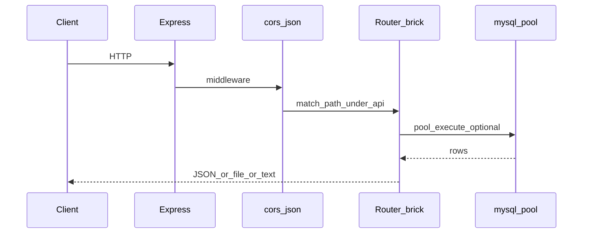

# Backend & server flow — documentation

How the **Express** app boots, loads config, and mounts **Lego brick** routers. Single entry: [`server.js`](../server.js).

---

## Boot sequence

1. **ESM imports** — All route modules are imported **before** `dotenv.config()` runs in `server.js`. Each brick that imports [`backend/config/db.js`](../backend/config/db.js) runs that module once: it calls **`dotenv.config()`** again and creates the **MySQL pool**. So env is available by the time listeners attach.
2. **`dotenv.config()`** in `server.js` — ensures root `.env` is loaded for `PORT` (fixed 5000 in code), `process.env.TZ`, etc.
3. **`process.env.TZ = 'Asia/Manila'`** — aligns server timezone with business rules.
4. **`express()`** — single app instance.
5. **Middleware** — `cors()`, `express.json()` (no global `express.urlencoded` for multipart; **multer** is used per-route in tickets/backup).
6. **Mount routers** — all under **`/api`** prefix (see order below).
7. **`app.listen(5000)`** — HTTP server.

There is **no** global authentication middleware: protected behavior is **frontend + optional headers** (e.g. `X-User-Email`) and **DB checks** inside handlers.

---

## Database pool

| File | Role |
|------|------|
| [`backend/config/db.js`](../backend/config/db.js) | `mysql2/promise` pool: `DB_HOST`, `DB_USER`, `DB_PASSWORD`, `DB_NAME`, `DB_PORT`, SSL `rejectUnauthorized: false`, `timezone: '+08:00'`, `dateStrings: true`, `connectionLimit: 10` |

**Shared:** Every route brick `import pool from '../config/db.js'` (or correct relative path) uses the same pool.

---

## Mount order (critical)

Routers are applied **in this order** ([`server.js`](../server.js)):

| Order | Router module | Mount path | Why order matters |
|-------|---------------|------------|-------------------|
| 1 | `authRoutes` | `/api` | Auth paths are specific (`/login`, `/verify-session`, …). |
| 2 | **`backupRoutes`** | `/api` | **Must be before `ticketRoutes`** so `GET /api/tickets/export`, `/export/preview`, `POST /api/tickets/archive` and `POST /api/tickets/import` are not captured by **`/tickets/:ticketId`**-style routes. |
| 3 | `ticketRoutes` | `/api` | Large surface: submit, track, `PUT/DELETE /tickets/:ticketId`, dispatch, hold, SMS, logs, crews, pool, status. |
| 4 | `userRoutes` | `/api` | Invite, users, profile, toggle. |
| 5 | `ticketFilterRoutes` | `/api` | `GET /filtered-tickets` only. |
| 6 | `ticketGroupingRoutes` | `/api` | `/tickets/group/*`, bulk restore. |
| 7 | `interruptionsRoutes` | `/api` | `/interruptions` CRUD. |
| 8 | `contactNumbersRoutes` | `/api` | `GET /contact-numbers`. |

**Within `tickets.js`:** `GET /tickets/logs` is defined **before** `GET /tickets/:ticketId/logs` so the path segment `logs` is not interpreted as a ticket id.

---

## Route inventory (by brick)

Prefixes below are **relative to `/api`**.

### auth.js
`POST` `/setup-account`, `/login`, `/google-login`, `/setup-google-account`, `/logout-all`, `/forgot-password`, `/reset-password`, `/verify-session`

### backup.js
`GET` `/tickets/export/preview`, `/tickets/export` · `POST` `/tickets/archive`, `/tickets/import`

### tickets.js
`POST` `/tickets/submit`, `/tickets/send-copy`, `/check-duplicates`  
`GET` `/tickets/track/:ticketId`, `/tickets/sms/receive`, `/tickets/logs`, `/tickets/:ticketId/logs`  
`PUT` `/tickets/:ticketId`, `/tickets/:ticket_id/dispatch`, `/tickets/:ticket_id/hold`, `/tickets/:ticketId/status`, **`/:ticketId/status`** (legacy)  
`DELETE` `/tickets/:ticketId`  
`GET/POST/PUT/DELETE` `/crews/list`, `/crews/add`, `/crews/update/:id`, `/crews/delete/:id`, `/pool/list`, `/pool/add`, `/pool/update/:id`, `/pool/delete/:id`

### user.js
`POST` `/invite`, `/send-email`, `/check-email`, `/users/toggle-status`  
`GET` `/users` · `PUT` `/users/profile`

### ticket-routes.js
`GET` `/filtered-tickets`

### ticket-grouping.js
`POST` `/tickets/group/create`  
`GET` `/tickets/groups`, `/tickets/group/:mainTicketId`  
`PUT` `/tickets/group/:mainTicketId/ungroup`, `/dispatch`, `/status`  
`PUT` `/tickets/bulk/restore`

### interruptions.js
`GET/POST` `/interruptions` · `PUT/DELETE` `/interruptions/:id`

### contact-numbers.js
`GET` `/contact-numbers`

### Inline (server.js)
`GET` `/api/debug/routes` — sample list (not exhaustive).

---

## Request flow (conceptual)

---

## Utilities (cross-cutting)

| Area | Files |
|------|--------|
| Ticket audit | [`backend/utils/ticketLogHelper.js`](../backend/utils/ticketLogHelper.js) |
| Phone | [`backend/utils/phoneUtils.js`](../backend/utils/phoneUtils.js) |
| SMS | [`backend/utils/sms.js`](../backend/utils/sms.js) |
| Uploads (submit) | multer + [`cloudinaryConfig.js`](../cloudinaryConfig.js) (from tickets brick) |
| Backup parse | ExcelJS, csv-parse/stringify in [`backup.js`](../backend/routes/backup.js) |

---

## Environment variables (backend-relevant)

| Variable | Typical use |
|----------|-------------|
| `DB_*` | MySQL pool |
| `EMAIL_USER` / `EMAIL_PASS` | Nodemailer (auth + user invite emails) |
| `CLOUDINARY_*` | Ticket image upload |
| `PHILSMS_*` (or project-specific) | Outbound SMS in tickets flow |

Frontend **`VITE_*`** vars are not read by `server.js`; they configure Vite and the browser (see [User & auth](./USER_AUTH_SCAN.md)).

---

## Related documentation

- [Ticket flow](./TICKET_FLOW_SCAN.md)
- [Data management](./DATA_MANAGEMENT_SCAN.md)
- [Personnel & history](./PERSONNEL_HISTORY_SCAN.md)
- [Users & auth](./USER_AUTH_SCAN.md)
- [Location, phone, SMS & API routes](./LOCATION_PHONE_SMS_API_SCAN.md)
