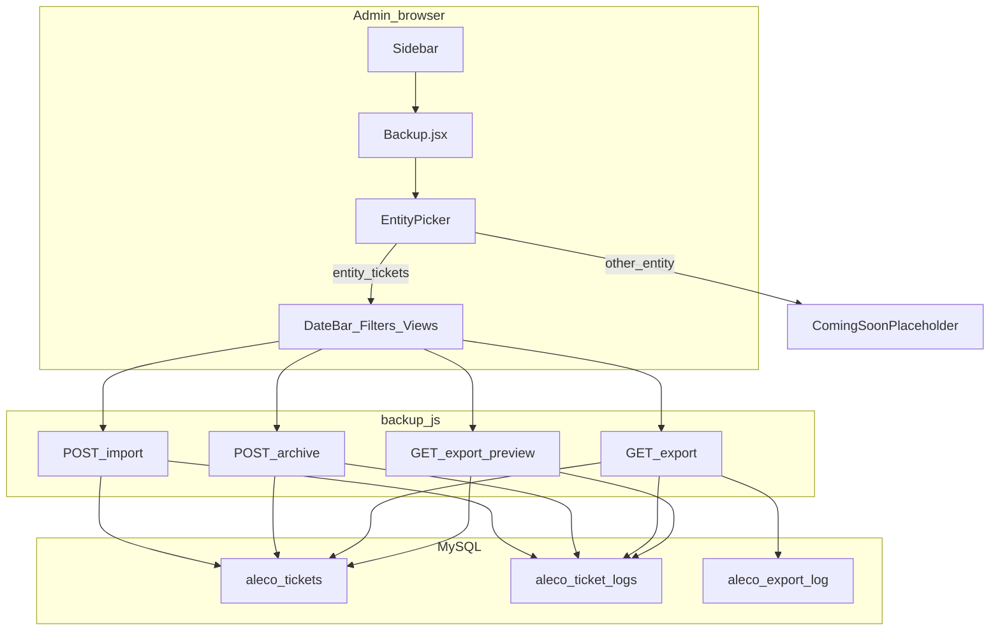

# Data Management — documentation

Admin feature for **export**, **import**, and **bulk delete** of operational data. In the UI it is labeled **Data Management** and reached from the sidebar at **`/admin-backup`**.

**Lego brick:** [`backend/routes/backup.js`](../backend/routes/backup.js) is mounted in [`server.js`](../server.js) **before** [`backend/routes/tickets.js`](../backend/routes/tickets.js) so these paths are registered before any `/tickets/:ticketId` handlers:

- `GET /api/tickets/export/preview`
- `GET /api/tickets/export`
- `POST /api/tickets/archive`
- `POST /api/tickets/import`

---

## Entry points

| Layer | Location |
|-------|----------|
| Route | [`src/App.jsx`](../src/App.jsx) — `<Route path="/admin-backup" element={<AdminBackup />} />` |
| Page component | [`src/components/Backup.jsx`](../src/components/Backup.jsx) |
| Sidebar | [`src/components/Sidebar.jsx`](../src/components/Sidebar.jsx) — link to `/admin-backup`, `activePage="backup"` |
| Backend | [`backend/routes/backup.js`](../backend/routes/backup.js) |

---

## Entity picker vs implemented workflows

Entities are defined in [`src/constants/dataManagementEntities.js`](../src/constants/dataManagementEntities.js) and rendered by [`src/components/backup/EntityPicker.jsx`](../src/components/backup/EntityPicker.jsx). The active entity is stored in **`localStorage`** under `dataManagementEntity`.

[`Backup.jsx`](../src/components/Backup.jsx) only renders the full date bar, filters, and export/import/archive UI when **`entity === 'tickets'`**. For **any other** entity id, it shows [`ComingSoonPlaceholder.jsx`](../src/components/backup/ComingSoonPlaceholder.jsx) — even if that entity is marked `available: true` in the constants file.

| Entity id | In `DATA_MANAGEMENT_ENTITIES` | Full Data Management UI today |
|-----------|------------------------------|--------------------------------|
| `tickets` | `available: true` | Yes — export, preview, archive, import |
| `interruptions` | `available: true` | No — placeholder until a branch is added for `entity === 'interruptions'` |
| `users`, `history`, `personnel` | `available: false` | No — placeholder |

Future work: add `entity === 'interruptions'` (and routes) or set `available: false` for interruptions until then, to avoid implying export/import exists for that entity.

---

## REST API (tickets data management)

All URLs are under the Express **`/api`** prefix. The frontend uses [`apiUrl()`](../src/utils/api.js) from the Vite app.

| Action | Method | Path | Notes |
|--------|--------|------|--------|
| Preview (JSON) | GET | `/api/tickets/export/preview` | Query: `preset` or `startDate`+`endDate`, plus optional filters (see below). Returns `tickets` + `logs` + `metadata`. |
| Download file | GET | `/api/tickets/export` | Same query params; `format=excel` (default) or `csv`. Optional headers: `X-User-Email`, `X-User-Name` (logged in `aleco_export_log`). |
| Request delete code | POST | `/api/tickets/archive/request-delete-code` | Admin only. Body: `email` (must match logged-in admin email). Sends 6-digit code to registered email. |
| Verify delete code | POST | `/api/tickets/archive/verify-delete-code` | Admin only. Body: `email`, `code`. Returns short-lived `deleteAuthToken` when valid. |
| Archive | POST | `/api/tickets/archive` | JSON body: same date + filter shape as export. Permanently deletes eligible tickets and their logs; grouped tickets are blocked until ungrouped. |
| Import dry run | POST | `/api/tickets/import?dryRun=true` | `multipart/form-data`, field **`file`** — `.xlsx` or `.csv`, max 10MB. |
| Import | POST | `/api/tickets/import` | Same as dry run; performs transactional insert. |

### Shared query / filter parameters

Used for export preview, export download, and archive (GET query string or POST JSON body as applicable):

- **Date:** `preset` (`today`, `last7`, `thisWeek`, `thisMonth`, `lastMonth`, `thisYear`) **or** `startDate` + `endDate` (custom range).
- **Optional filters:** `category`, `district`, `municipality`, `status`, `groupFilter` (`all` | `grouped` | `ungrouped`), `isNew` (`true` = last 48 hours), `isUrgent` (`true`).
- **Export only:** `format` — `excel` | `csv`.

Server-side selection is implemented in **`buildTicketQuery`** in [`backup.js`](../backend/routes/backup.js): `aleco_tickets` rows with **`deleted_at IS NULL`**, `DATE(created_at)` in range, and group visibility rules aligned with the admin ticket list (GROUP masters + ungrouped children hidden from base set, etc.).

---

## Backend behavior (summary)

### Export

1. Runs `buildTicketQuery` for the date range and filters.
2. Loads matching rows from **`aleco_tickets`**.
3. Loads **`aleco_ticket_logs`** for those `ticket_id` values.
4. **Excel:** ExcelJS workbook with sheets **Metadata**, **Tickets**, **TicketLogs** (column keys from row objects; `metadata` JSON stringified where needed).
5. **CSV:** Ticket rows only (`csv-stringify`).
6. Inserts a row into **`aleco_export_log`** (`export_date`, `date_start`, `date_end`, `ticket_count`, `log_count`, `format`, `exported_by`).

### Archive

1. Admin requests a 6-digit delete code using their own logged-in email and verifies it to receive a short-lived `deleteAuthToken`.
2. Archive request requires that `deleteAuthToken`; without it, delete is rejected.
3. Route resolves the same ticket set as export (via a select variant of the query).
4. Grouped tickets (`GROUP-*`, children, and tickets with children) are blocked and returned as blocked.
5. Eligible ungrouped tickets are permanently deleted, including logs and linked service memo cleanup.
6. Response includes `{ success, deletedCount, blockedGroupedCount, blockedSampleIds }`.

**UI behavior** ([`Backup.jsx`](../src/components/Backup.jsx)): delete controls are visible to admins only; employees see export/import only. Admins must complete email-code verification before permanent delete can run.

### Import

1. Multer **memory** storage; file filter **`.xlsx` / `.csv`** only.
2. **XLSX:** prefers worksheet **Tickets**, optional **TicketLogs**; falls back to worksheet order if names differ.
3. **CSV:** parsed as ticket rows only (no logs from CSV path).
4. Validates required columns: `ticket_id`, `first_name`, `last_name`, `phone_number`, `category`, `concern`.
5. Skips rows whose `ticket_id` already exists in **`aleco_tickets`**.
6. **Transaction:** orders inserts so **`parent_ticket_id`** references appear after parents within the import batch; then **`INSERT`** into `aleco_tickets` and eligible **`aleco_ticket_logs`** rows.
7. **`dryRun=true`:** returns counts and validation errors without writing.

---

## Frontend components

| Component | Role |
|-----------|------|
| [`Backup.jsx`](../src/components/Backup.jsx) | State, handlers, layout shell, `AdminLayout`, modals |
| [`EntityPicker.jsx`](../src/components/backup/EntityPicker.jsx) | Entity tabs + `localStorage` |
| [`BackupLayoutPicker.jsx`](../src/components/backup/BackupLayoutPicker.jsx) | `compact` / `cards` / `workflow` |
| [`BackupDateBar.jsx`](../src/components/backup/BackupDateBar.jsx) | Presets + custom range |
| [`BackupFiltersBar.jsx`](../src/components/backup/BackupFiltersBar.jsx) | Category, district, municipality, status, group, new, urgent |
| [`BackupCompactView.jsx`](../src/components/backup/BackupCompactView.jsx), [`BackupCardsView.jsx`](../src/components/backup/BackupCardsView.jsx), [`BackupWorkflowView.jsx`](../src/components/backup/BackupWorkflowView.jsx) | Same actions, different layout |
| [`ExportPreviewModal.jsx`](../src/components/backup/ExportPreviewModal.jsx) | Renders JSON preview from export/preview |
| [`ComingSoonPlaceholder.jsx`](../src/components/backup/ComingSoonPlaceholder.jsx) | Non-ticket entities |

**Styles:** [`src/CSS/Backup.css`](../src/CSS/Backup.css), [`BackupLayoutPicker.css`](../src/CSS/BackupLayoutPicker.css), [`EntityPicker.css`](../src/CSS/EntityPicker.css).

**HTTP client:** `fetch` + `apiUrl` (not axios); global axios loader does not apply to these calls.

---

## Visual — flow

---

## Related documentation

- [Docs index](./README.md)
- [Backend & server flow](./BACKEND_SERVER_FLOW.md)
- [Ticket flow](./TICKET_FLOW_SCAN.md) (module **G** and mount order)
- [Users & auth](./USER_AUTH_SCAN.md)

---

## Changelog note

Document generated from a codebase scan of the ALECO PIS repo; update this file when new entities gain real export/archive/import routes or when `Backup.jsx` entity branching changes.
