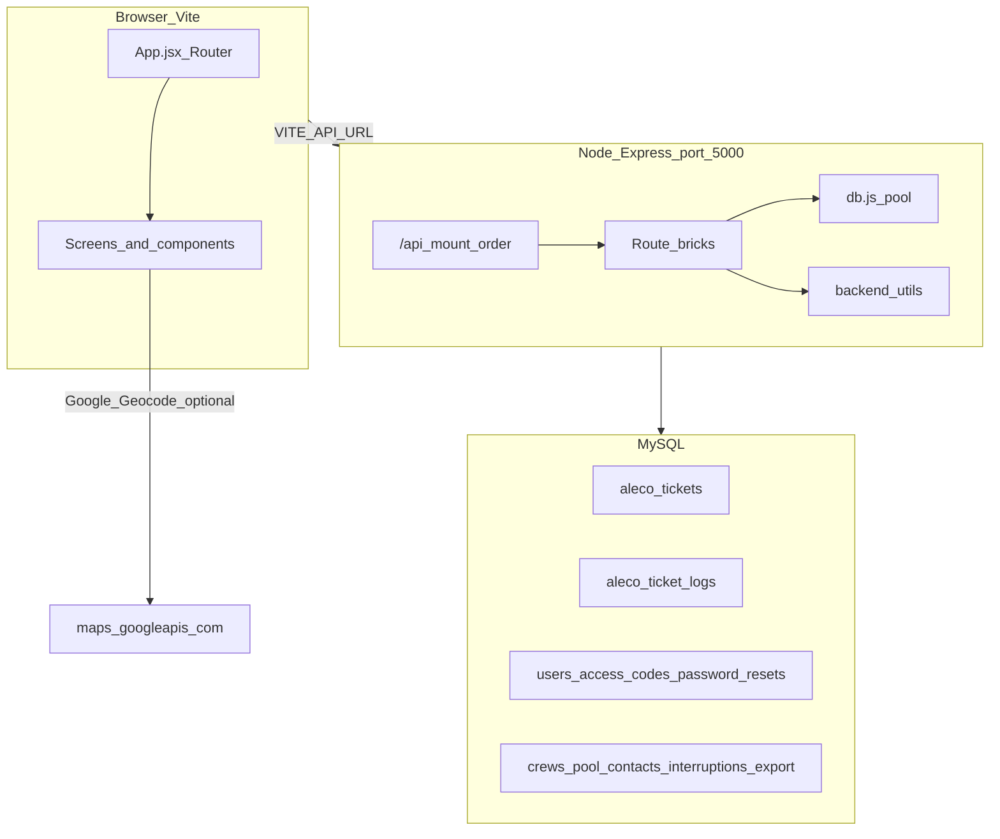

# ALECO PIS — full codebase map (navigational spine)

**Purpose:** Single index of repository layout, HTTP surface, React routes → API usage, DB touchpoints, migrations, environment variables, and known gaps. Cross-links deeper scans in `docs/` and [`CODEBASE_SCAN_REPORT.md`](../CODEBASE_SCAN_REPORT.md).

**Stack:** Vite + React 19 (`src/`), Express 5 (`server.js`, `backend/`), MySQL (`mysql2` pool in `backend/config/db.js`).

---

## 1. Executive map

**Express mount order** ([`server.js`](../server.js)): `auth` → `backup` → `tickets` → `user` → `ticket-routes` → `ticket-grouping` → `interruptions` → `contact-numbers`. Backup is before `tickets` so `/tickets/export` etc. resolve on the backup brick.

---

## 2. Directory roles and file manifest

| Area | Path | Role |
|------|------|------|
| App shell | [`src/main.jsx`](../src/main.jsx), [`src/App.jsx`](../src/App.jsx) | React root, `GoogleOAuthProvider`, router, session verify on navigation |
| API client | [`src/utils/api.js`](../src/utils/api.js), [`src/api/axiosConfig.js`](../src/api/axiosConfig.js) | `apiUrl(path)` vs axios `baseURL` |
| Admin UI | [`src/components/*.jsx`](../src/components/) | Tickets, Users, Backup, History, Personnel, Interruptions, layout, tickets/* subfolder |
| Public UI | [`src/ReportaProblem.jsx`](../src/ReportaProblem.jsx), [`src/InterruptionList.jsx`](../src/InterruptionList.jsx), [`About.jsx`](../src/About.jsx), etc. | Landing stack on `/` |
| Shared front utils | [`src/utils/`](../src/utils/) | Tickets hook, GPS/phone/date, kanban helpers |
| Constants | [`src/constants/`](../src/constants/) | Roles, data-management entity list |
| Styles | [`src/CSS/`](../src/CSS/) | Page and component CSS |
| Server entry | [`server.js`](../server.js) | CORS, JSON, mounts, `TZ=Asia/Manila` |
| HTTP bricks | [`backend/routes/`](../backend/routes/) | All `/api` handlers |
| DB | [`backend/config/db.js`](../backend/config/db.js) | Pool from env |
| Shared back utils | [`backend/utils/`](../backend/utils/) | SMS, phone normalize, ticket logs |
| Schema deltas | [`backend/migrations/*.sql`](../backend/migrations/) | Tables/columns (run via [`backend/run-migration.js`](../backend/run-migration.js)) |
| Uploads | [`cloudinaryConfig.js`](../cloudinaryConfig.js) | Multer → Cloudinary (imported by `tickets.js`) |
| Offline / tooling | [`geocoder.js`](../geocoder.js), [`alecoScope.js`](../alecoScope.js) | Not part of runtime HTTP API |
| Build | [`vite.config.js`](../vite.config.js), [`eslint.config.js`](../eslint.config.js) | Tailwind Vite plugin, React, `allowedHosts` |

**`src` JS/JSX file count (approx.):** 93 files under `src/` (components, utils, pages).

---

## 3. React routes → API matrix

| React route | Root component | Primary `/api` calls (and notes) |
|-------------|----------------|-----------------------------------|
| `/` | `InterruptionList`, `ReportaProblem`, `About`, `PrivacyNotice`, `Footer` | `GET /api/interruptions`, `POST /api/tickets/submit`, `POST /api/check-duplicates`, `GET /api/tickets/track/:id`, `POST /api/tickets/send-copy`, `GET /api/contact-numbers`; **external** Google Geocode (`VITE_GOOGLE_MAPS_API_KEY`) |
| `/admin-dashboard` | [`Dashboard.jsx`](../src/Dashboard.jsx) | None (placeholder) |
| `/admin-users` | [`Users.jsx`](../src/components/Users.jsx) → Invite / AllUsers | `POST /api/check-email`, `POST /api/invite`, `POST /api/send-email`, `GET /api/users`, `POST /api/users/toggle-status` |
| `/admin-tickets` | [`Tickets.jsx`](../src/components/Tickets.jsx) + children | `GET /api/filtered-tickets` (via [`useTickets.js`](../src/utils/useTickets.js)), `GET /api/crews/list`, group/dispatch/hold/status/delete/restore/create per ticket APIs (see §4) |
| `/admin-interruptions` | [`Interruptions.jsx`](../src/components/Interruptions.jsx) | `GET/POST/PUT/DELETE /api/interruptions` |
| `/admin-history` | [`History.jsx`](../src/components/History.jsx) | `GET /api/tickets/logs` |
| `/admin-backup` | [`Backup.jsx`](../src/components/Backup.jsx) | `GET /api/tickets/export`, `GET /api/tickets/export/preview`, `POST /api/tickets/archive`, `POST /api/tickets/import` (+ dryRun) |
| `/admin-profile` | [`ProfilePage.jsx`](../src/components/profile/ProfilePage.jsx) | `PUT /api/users/profile` |
| `/admin-personnel` | [`PersonnelManagement.jsx`](../src/components/PersonnelManagement.jsx) | `GET /api/crews/list`, `GET /api/pool/list`, `POST/PUT /api/crews/add|update/:id`, `POST/PUT /api/pool/add|update/:id` |
| *(global)* | [`App.jsx`](../src/App.jsx) session guard | `POST /api/verify-session` |
| Login modal | [`login.jsx`](../src/components/buttons/login.jsx) | `POST /api/login`, `POST /api/google-login`, `POST /api/setup-account`, `POST /api/setup-google-account`, `POST /api/forgot-password`, `POST /api/reset-password` |
| Logout (sidebar) | [`SearchBarGlobal.jsx`](../src/components/searchBars/SearchBarGlobal.jsx) | `POST /api/logout-all` |

**Ticket detail / modals** (under admin tickets): [`TicketHistoryLogs.jsx`](../src/components/tickets/TicketHistoryLogs.jsx) → `GET /api/tickets/:ticketId/logs`; [`TicketDetailPane.jsx`](../src/components/tickets/TicketDetailPane.jsx) → `GET /api/tickets/group/:mainTicketId`; [`EditTicketModal.jsx`](../src/components/tickets/EditTicketModal.jsx) → `PUT /api/tickets/:id`; [`DispatchTicketModal.jsx`](../src/components/tickets/DispatchTicketModal.jsx) → `GET /api/crews/list?availableOnly=true`, group fetch.

---

## 4. Complete Express route inventory (by brick)

Paths are relative to **`/api`** prefix.

### [`backend/routes/auth.js`](../backend/routes/auth.js)

| Method | Path |
|--------|------|
| POST | `/setup-account`, `/login`, `/google-login`, `/setup-google-account`, `/logout-all`, `/forgot-password`, `/reset-password`, `/verify-session` |

**DB:** `access_codes`, `users`, `password_resets` (plus `token_version` on users). **Email:** `EMAIL_USER`, `EMAIL_PASS`.

### [`backend/routes/backup.js`](../backend/routes/backup.js)

| Method | Path |
|--------|------|
| GET | `/tickets/export/preview`, `/tickets/export` |
| POST | `/tickets/archive`, `/tickets/import` |

**DB:** `aleco_tickets`, `aleco_ticket_logs`, `aleco_export_log`.

### [`backend/routes/tickets.js`](../backend/routes/tickets.js)

| Method | Path |
|--------|------|
| POST | `/tickets/submit`, `/tickets/send-copy`, `/check-duplicates` |
| GET | `/tickets/track/:ticketId`, `/tickets/sms/receive`, `/tickets/logs`, `/tickets/:ticketId/logs`, `/crews/list`, `/pool/list` |
| PUT | `/tickets/:ticketId`, `/tickets/:ticket_id/dispatch`, `/tickets/:ticket_id/hold`, `/tickets/:ticketId/status`, `/:ticketId/status` (legacy alias) |
| PUT | `/crews/update/:id`, `/pool/update/:id` |
| POST | `/crews/add`, `/pool/add` |
| DELETE | `/tickets/:ticketId`, `/crews/delete/:id` |

**DELETE `/crews/delete/:id`:** implemented on server; **no** matching call found in `src/` (crew removal may be unused from UI).

**Utils:** [`sms.js`](../backend/utils/sms.js), [`phoneUtils.js`](../backend/utils/phoneUtils.js), [`ticketLogHelper.js`](../backend/utils/ticketLogHelper.js). **Upload:** [`cloudinaryConfig.js`](../cloudinaryConfig.js). **Tables (typical):** `aleco_tickets`, `aleco_ticket_logs`, `aleco_personnel`, `aleco_crew_members`, `aleco_linemen_pool`.

### [`backend/routes/user.js`](../backend/routes/user.js)

| Method | Path |
|--------|------|
| POST | `/invite`, `/send-email`, `/check-email` |
| GET | `/users` |
| PUT | `/users/profile` |
| POST | `/users/toggle-status` |

**DB:** `users`, `access_codes`. **Email:** nodemailer + `EMAIL_*`.

### [`backend/routes/ticket-routes.js`](../backend/routes/ticket-routes.js)

| Method | Path |
|--------|------|
| GET | `/filtered-tickets` |

**DB:** `aleco_tickets` (complex filters, group visibility, soft delete).

### [`backend/routes/ticket-grouping.js`](../backend/routes/ticket-grouping.js)

| Method | Path |
|--------|------|
| POST | `/tickets/group/create` |
| GET | `/tickets/groups`, `/tickets/group/:mainTicketId` |
| PUT | `/tickets/group/:mainTicketId/ungroup`, `/dispatch`, `/status` |
| PUT | `/tickets/bulk/restore` |

**DB:** Primarily **`aleco_tickets`** (master rows with `ticket_id` like `GROUP-%`, `parent_ticket_id`, `visit_order`, `group_type`); `aleco_personnel` for crew phone on dispatch SMS. **Utils:** `sms.js`, `ticketLogHelper.js`.

**Note:** SQL migration [`create_ticket_grouping_tables.sql`](../backend/migrations/create_ticket_grouping_tables.sql) defines `aleco_ticket_groups` / `aleco_ticket_group_members`; **runtime grouping in code uses `aleco_tickets` + `parent_ticket_id`**, not those junction tables.

**GET `/tickets/groups`:** no caller in `src/` found (optional/admin tool or future use).

### [`backend/routes/interruptions.js`](../backend/routes/interruptions.js)

| Method | Path |
|--------|------|
| GET | `/interruptions` |
| POST | `/interruptions` |
| PUT | `/interruptions/:id` |
| DELETE | `/interruptions/:id` |

**DB:** `aleco_interruptions`.

**Client:** [`src/api/interruptionsApi.js`](../src/api/interruptionsApi.js) — shared list/CRUD; admin list uses `includeFuture=1` to include not-yet-public rows. Public landing uses [`usePublicInterruptions`](../src/hooks/usePublicInterruptions.js) (no `includeFuture`) and [`src/utils/interruptionDateFormat.js`](../src/utils/interruptionDateFormat.js) for readable times. **DB:** optional `public_visible_at` — NULL = visible immediately; future time hides row from public GET until then ([`add_public_visible_at_interruptions.sql`](../backend/migrations/add_public_visible_at_interruptions.sql)).

### [`backend/routes/contact-numbers.js`](../backend/routes/contact-numbers.js)

| Method | Path |
|--------|------|
| GET | `/contact-numbers` |

**DB:** `aleco_contact_numbers`.

### Other server routes

| Method | Path | Location |
|--------|------|----------|
| GET | `/api/debug/routes` | [`server.js`](../server.js) — sample list only, not exhaustive |

---

## 5. Backend utils → consumers

| Module | Used by |
|--------|---------|
| [`backend/utils/sms.js`](../backend/utils/sms.js) | `tickets.js`, `ticket-grouping.js` |
| [`backend/utils/phoneUtils.js`](../backend/utils/phoneUtils.js) | `tickets.js` |
| [`backend/utils/ticketLogHelper.js`](../backend/utils/ticketLogHelper.js) | `tickets.js`, `ticket-grouping.js` |

---

## 6. Migrations summary (schema narrative)

| File | Effect |
|------|--------|
| [`fix_status_enum.sql`](../backend/migrations/fix_status_enum.sql) | `aleco_tickets.status` enum baseline (`Pending`, `Ongoing`, `Restored`, `Unresolved`) — **historical**; superseded in part by later enums |
| [`add_deleted_at_to_tickets.sql`](../backend/migrations/add_deleted_at_to_tickets.sql) | `aleco_tickets.deleted_at` soft delete |
| [`add_dispatched_at.sql`](../backend/migrations/add_dispatched_at.sql) | `aleco_tickets.dispatched_at` |
| [`add_hold_columns.sql`](../backend/migrations/add_hold_columns.sql) | `hold_reason`, `hold_since` |
| [`add_nff_access_denied_status.sql`](../backend/migrations/add_nff_access_denied_status.sql) | Extends ticket `status` with `NoFaultFound`, `AccessDenied` |
| [`add_phone_index.sql`](../backend/migrations/add_phone_index.sql) | Index on `(phone_number, created_at)` |
| [`add_ticket_logs.sql`](../backend/migrations/add_ticket_logs.sql) | Table `aleco_ticket_logs` |
| [`add_export_log.sql`](../backend/migrations/add_export_log.sql) | Table `aleco_export_log` |
| [`add_lineman_leave_columns.sql`](../backend/migrations/add_lineman_leave_columns.sql) | `aleco_linemen_pool` leave fields + status enum includes `Leave` |
| [`add_group_type_and_visit_order.sql`](../backend/migrations/add_group_type_and_visit_order.sql) | `aleco_tickets.group_type`, `visit_order` |
| [`create_contact_numbers.sql`](../backend/migrations/create_contact_numbers.sql) | Table `aleco_contact_numbers` + seed rows |
| [`create_ticket_grouping_tables.sql`](../backend/migrations/create_ticket_grouping_tables.sql) | `aleco_ticket_groups`, `aleco_ticket_group_members`, `is_grouped`/`group_id` on tickets — **tables may exist without being used by current Node grouping code** |
| [`create_aleco_interruptions.sql`](../backend/migrations/create_aleco_interruptions.sql) | Table `aleco_interruptions` |
| [`add_facebook_style_interruptions.sql`](../backend/migrations/add_facebook_style_interruptions.sql) | `body`, `control_no`, `image_url` on `aleco_interruptions` (run before `alter_interruptions_nullable`) |
| [`alter_interruptions_nullable.sql`](../backend/migrations/alter_interruptions_nullable.sql) | `affected_areas`, `cause` nullable on `aleco_interruptions` (run after `add_facebook_style_interruptions`) |

Run helper: [`backend/run-migration.js`](../backend/run-migration.js).

---

## 7. Environment variables (names only)

| Variable | Where used |
|----------|------------|
| `DB_HOST`, `DB_USER`, `DB_PASSWORD`, `DB_NAME`, `DB_PORT` | [`backend/config/db.js`](../backend/config/db.js) |
| `EMAIL_USER`, `EMAIL_PASS` | `auth.js`, `user.js`, `tickets.js` (nodemailer) |
| `PHILSMS_API_URL`, `PHILSMS_SENDER_ID`, `PHILSMS_API_KEY` | [`backend/utils/sms.js`](../backend/utils/sms.js) |
| `CLOUDINARY_CLOUD_NAME`, `CLOUDINARY_API_KEY`, `CLOUDINARY_API_SECRET` | [`cloudinaryConfig.js`](../cloudinaryConfig.js) |
| `GOOGLE_API_KEY` | [`geocoder.js`](../geocoder.js) (CLI/maintenance) |
| `VITE_API_URL` | [`src/utils/api.js`](../src/utils/api.js), [`src/api/axiosConfig.js`](../src/api/axiosConfig.js) |
| `VITE_GOOGLE_CLIENT_ID` | [`src/main.jsx`](../src/main.jsx) |
| `VITE_GOOGLE_MAPS_API_KEY` | [`src/ReportaProblem.jsx`](../src/ReportaProblem.jsx) (browser geocode) |

Server also sets `process.env.TZ = 'Asia/Manila'` in [`server.js`](../server.js).

### Build and lint ([`vite.config.js`](../vite.config.js), [`eslint.config.js`](../eslint.config.js))

- **Vite:** `@vitejs/plugin-react`, `@tailwindcss/vite`; dev `server.allowedHosts` includes a project ngrok hostname.
- **ESLint 9 (flat):** `js.configs.recommended`, `eslint-plugin-react-hooks`, `react-refresh` for Vite; `globalIgnores(['dist'])`; `no-unused-vars` with `varsIgnorePattern` for `^[A-Z_]`.

---

## 8. Gaps, orphans, and doc drift

| Item | Notes |
|------|--------|
| [`src/VisitUs.jsx`](../src/VisitUs.jsx) | **Orphan:** not imported by `App.jsx` or any other file under `src/`. Safe to remove or wire to a route. |
| `GET /api/tickets/groups` | **Backend only** in current `src/` grep — no UI consumer found. |
| `DELETE /api/crews/delete/:id` | **Backend only** — no frontend caller found. |
| `aleco_ticket_groups` / `aleco_ticket_group_members` | Present in migration; **live grouping** uses `GROUP-*` rows in `aleco_tickets` + `parent_ticket_id`. |
| [`CODEBASE_SCAN_REPORT.md`](../CODEBASE_SCAN_REPORT.md) Task 1 | **Updated (2026):** removed stale “InterruptionList hardcoded vs admin API” inconsistency; public and admin both use `/api/interruptions`. |
| Debug endpoint | `/api/debug/routes` is **not** a full route catalog. |

---

## 9. Related documentation

| Doc | Focus |
|-----|--------|
| [`BACKEND_SERVER_FLOW.md`](./BACKEND_SERVER_FLOW.md) | Mount order, pool, per-brick narrative |
| [`TICKET_FLOW_SCAN.md`](./TICKET_FLOW_SCAN.md) | Ticket UX and lifecycle |
| [`DATA_MANAGEMENT_SCAN.md`](./DATA_MANAGEMENT_SCAN.md) | Backup/export/import |
| [`USER_AUTH_SCAN.md`](./USER_AUTH_SCAN.md) | Auth, session, invites |
| [`PERSONNEL_HISTORY_SCAN.md`](./PERSONNEL_HISTORY_SCAN.md) | Crews, pool, history logs |
| [`LOCATION_PHONE_SMS_API_SCAN.md`](./LOCATION_PHONE_SMS_API_SCAN.md) | Geography, phone, SMS, consolidated API table |
| [`CODEBASE_SCAN_REPORT.md`](../CODEBASE_SCAN_REPORT.md) | Task-based verification and findings |

---

*Generated as part of the full codebase map audit; keep in sync when adding routes, screens, or migrations.*
