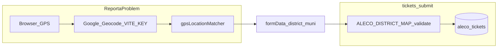

# Location, phone, SMS, and API routes — documentation

Scan of **location/GPS**, **Philippine phone handling**, **SMS** (outbound PhilSMS + inbound Yeastar webhook), and a **consolidated `/api` route surface**. Sources: [`alecoScope.js`](../alecoScope.js), [`src/utils/gpsLocationMatcher.js`](../src/utils/gpsLocationMatcher.js), [`src/ReportaProblem.jsx`](../src/ReportaProblem.jsx), [`backend/routes/tickets.js`](../backend/routes/tickets.js), [`backend/routes/ticket-grouping.js`](../backend/routes/ticket-grouping.js), [`backend/utils/sms.js`](../backend/utils/sms.js), [`backend/utils/phoneUtils.js`](../backend/utils/phoneUtils.js), [`src/utils/phoneUtils.js`](../src/utils/phoneUtils.js), [`backend/routes/contact-numbers.js`](../backend/routes/contact-numbers.js), map components, [`geocoder.js`](../geocoder.js), [`server.js`](../server.js).

---

## 1. Location-related features

### 1.1 Canonical geography

- **[`alecoScope.js`](../alecoScope.js)** — `ALECO_SCOPE`: districts and municipalities (optional `googleName` for matching). Used by the **frontend** matcher.
- **[`backend/routes/tickets.js`](../backend/routes/tickets.js)** (lines 21–50) — **`ALECO_DISTRICT_MAP`**: duplicate structure for **server-side** validation on submit and ticket edit.

**Maintenance risk:** frontend scope and backend map can drift if only one is updated.

### 1.2 Public “Report a Problem”

- **[`src/ReportaProblem.jsx`](../src/ReportaProblem.jsx)** — Multi-step form; location uses **district + municipality** plus optional **GPS**.
- **Find my location:** browser geolocation → **Google Geocoding REST** (`latlng=…&key=VITE_GOOGLE_MAPS_API_KEY`) → address components → **[`matchGPSToAlecoScope`](../src/utils/gpsLocationMatcher.js)** → **[`validateDistrictMunicipality`](../src/utils/gpsLocationMatcher.js)** against `ALECO_SCOPE` → sets `reported_lat/lng`, accuracy, method, confidence, address text.
- **Manual path:** user picks district/municipality (must match ALECO lists).
- **Preview:** [`LocationPreviewMap.jsx`](../src/components/LocationPreviewMap.jsx) — map from lat/lng + labels.

### 1.3 Backend persistence and validation

- **POST `/api/tickets/submit`** — Valid **district + municipality** via backend `validateDistrictMunicipality`. Stores GPS columns when provided. Phone via `normalizePhoneForDB`.
- **PUT `/api/tickets/:ticketId`** — Same rules when updating location; partial district without municipality rejected.

### 1.4 Admin / display

- **Filters:** district/municipality in [`useTickets`](../src/utils/useTickets.js), filter UI, backup export filters.
- **Display:** Kanban/table use `municipality, district` strings ([`kanbanHelpers.js`](../src/utils/kanbanHelpers.js), [`TicketTableView.jsx`](../src/components/tickets/TicketTableView.jsx), [`KanbanTicketCard.jsx`](../src/components/tickets/kanban/KanbanTicketCard.jsx)).
- **[`CoverageMap.jsx`](../src/components/CoverageMap.jsx)** — Admin map of tickets with coordinates ([`Tickets.jsx`](../src/components/Tickets.jsx)); no separate location API.

### 1.5 Maintenance script (not Express)

- **[`geocoder.js`](../geocoder.js)** — Node script with **`GOOGLE_API_KEY`** (server `.env`) to geocode municipalities and maintain scope data. Not part of runtime HTTP API.

---

## 2. Phone number features

### 2.1 Backend ([`backend/utils/phoneUtils.js`](../backend/utils/phoneUtils.js))

- **`sanitizePhoneDigits`** — Trim, replace common unicode spaces, then strip non-digits (keep in sync with frontend).
- **`normalizePhoneForDB` / `normalizePhoneForSMS`** — After sanitization: strip leading **`00`** if present; accept **12-digit `63` + 10-digit mobile subscriber (must start with `9`)**, **11-digit `09…`**, **10-digit `9…`** → canonical **`639XXXXXXXXX`**. Invalid → `null`.
- **`INVALID_PHONE_MESSAGE`** — Exported string for consistent 400 responses.
- **Used for:** ticket submit/edit, **`POST /check-duplicates`** (returns **400** with `invalidPhone: true` if normalization fails — no raw-string fallback), SMS recipients, inbound SMS sender normalization, crew/lineman CRUD phones.

### 2.2 Frontend ([`src/utils/phoneUtils.js`](../src/utils/phoneUtils.js))

- **`sanitizePhoneDigits`** — Same rules as backend.
- **`toDisplayFormat` / `formatPhoneDisplay`** — `639…`, pasted `+63…`, or `00…` → `09…` for mobile; non-mobile strings pass through for landline-style display.
- **`normalizeForSubmit`** — Trim; server normalizes.
- **`validatePhilippineMobile`** — Same acceptance as backend; used before submit on Report a Problem path (with duplicate check), personnel modals, and edit ticket.
- **`INVALID_PHONE_HINT`** — Same wording as `INVALID_PHONE_MESSAGE` (maintain manually in sync).

### 2.3 UI touchpoints

- **Report a Problem** — [`PhoneInputProblem.jsx`](../src/components/textfields/PhoneInputProblem.jsx); **`POST /api/check-duplicates`** **400** → toast with server `message`.
- **Personnel** — [`AddCrew.jsx`](../src/components/personnels/AddCrew.jsx), [`AddLinemen.jsx`](../src/components/personnels/AddLinemen.jsx) validate before save; server still enforces normalization.
- **Admin edit ticket** — [`EditTicketModal.jsx`](../src/components/tickets/EditTicketModal.jsx) validates phone; loads display form via `toDisplayFormat`.
- **Hotlines:** [`HotlinesDisplay.jsx`](../src/components/contact/HotlinesDisplay.jsx) — `GET /api/contact-numbers`, **`toTelHref`** for `tel:`; hotlines are **not** required to pass mobile normalization.

### 2.4 Data

- Consumer: **`aleco_tickets.phone_number`**
- Crew: **`aleco_personnel.phone_number`**
- Lineman: **`aleco_linemen_pool.contact_no`**

### 2.5 Normalization matrix (mobile-only for tickets / personnel / SMS)

| Input shape | Stored / PhilSMS `recipient` |
|-------------|------------------------------|
| `09XXXXXXXXX` (11 digits, second digit `9`) | `639XXXXXXXXX` |
| `+63 …` with spaces / dashes / unicode spaces | `639XXXXXXXXX` after digit extract |
| `9XXXXXXXXX` (10 digits) | `639XXXXXXXXX` |
| `0063917…` | `639…` after removing `00` |
| `63` + 12 digits (mobile) | unchanged if subscriber is `9` + 9 digits |
| Landline-style (e.g. `052…`, `02…` without mobile pattern) | **Rejected** for tickets, crew, pool (PhilSMS mobile path) |

---

## 3. SMS-related features

### 3.1 Outbound — [`backend/utils/sms.js`](../backend/utils/sms.js)

- **`sendPhilSMS(number, messageBody)`** — `normalizePhoneForSMS` → POST **`{base}/api/v3/sms/send`** where **`base`** comes from **`PHILSMS_API_URL`** (optional) or defaults to **`https://dashboard.philsms.com`**. You may set **`PHILSMS_API_URL`** to the base only (`https://dashboard.philsms.com`) or to the full documented URL — if the value ends with **`/api/v3/sms/send`**, the code strips that suffix so the path is not doubled. Trailing slashes on the base are stripped. Bearer **`PHILSMS_API_KEY`**, JSON body: `recipient`, `message`, `sender_id` (`PHILSMS_SENDER_ID`), `type: plain`.
- **Return value:** `{ success, skipped?, reason?, providerMessage? }` — not a bare boolean. `reason` examples: `invalid_number`, `no_api_key`, `unexpected_response`, `http_error`, `network_error`. `providerMessage` is a short, operator-safe hint (truncated).

**API host:** Project default base is **`https://dashboard.philsms.com`** (full send URL **`https://dashboard.philsms.com/api/v3/sms/send`**). Some PhilSMS docs mention **`https://app.philsms.com`** — if your token only works there, set **`PHILSMS_API_URL=https://app.philsms.com`** in root **`.env`**. Wrong host + token mismatch often appears as **`Unauthenticated`**.

#### 3.1.1 Dispatch / group-dispatch / hold — HTTP + `sms` payload

| Endpoint | Lineman / crew SMS fails | Consumer SMS fails (optional) |
|----------|--------------------------|--------------------------------|
| `PUT /api/tickets/:ticket_id/dispatch` | **502** `success: false` — **ticket not updated** | **200** `success: true`, `warnings: ["consumer_sms_failed"]`, crew SMS already succeeded |
| `PUT /api/tickets/group/:mainTicketId/dispatch` | **502** — **no member tickets updated** | **200** + `warnings` if any member consumer send failed |
| `PUT /api/tickets/:ticket_id/hold` | N/A | **200** (hold already saved) + `warnings` if notify was on and send failed |

Response shapes (abridged):

- **Dispatch success:** `{ success, message, sms: { lineman: { success: true }, consumer: { attempted, skipped?, success?, reason?, … } } }`
- **Group dispatch success:** `{ success, message, dispatchedCount, sms: { lineman: { success: true }, consumers: [{ ticket_id, attempted, … }] } }`
- **Hold success:** `{ success, message, sms: { consumer: … } }`

Admin [`Tickets.jsx`](../src/components/Tickets.jsx) shows **warning** toasts when `warnings` includes `consumer_sms_failed`, and **error** toasts on **502** dispatch (no false “SMS sent” when the ticket was not updated).

### 3.2 Where outbound SMS runs

| Location | When | Recipients |
|----------|------|------------|
| [`tickets.js`](../backend/routes/tickets.js) `PUT .../dispatch` | After consumer + crew phone lookup | Lineman (if crew has phone); consumer if `is_consumer_notified` |
| [`tickets.js`](../backend/routes/tickets.js) hold route | Hold notification path | Consumer when applicable |
| [`ticket-grouping.js`](../backend/routes/ticket-grouping.js) group dispatch | Group dispatch | Lineman + optional members/consumers |

**Note:** **`POST /api/tickets/send-copy`** sends **email only** (Nodemailer), not SMS.

### 3.3 Inbound — `GET /api/tickets/sms/receive` ([`tickets.js`](../backend/routes/tickets.js))

- **Query params (Yeastar-style):** `number` / `sender`, `text` / `content`.
- **Flow:** normalize sender → match **`aleco_personnel.phone_number`** → resolve **Ongoing** tickets → keyword / ticket-id parsing (`ALECO-*`, `GROUP-*`, bulk “all …”, hold/enroute, etc.) → `UPDATE aleco_tickets` + **`insertTicketLog`** (`actor_type: 'sms_lineman'`).

Inbound logic lives in the **tickets** brick, not a separate SMS router file.

---

## 4. All API routes (under `/api`)

Mounted from [`server.js`](../server.js): **auth → backup → tickets → user → ticket-routes → ticket-grouping → interruptions → contact-numbers**. Full path = `/api` + path in table.

| Brick | Method | Path | Primary purpose |
|-------|--------|------|-----------------|
| auth | POST | `/setup-account`, `/login`, `/google-login`, `/setup-google-account`, `/logout-all`, `/forgot-password`, `/reset-password`, `/verify-session` | Identity, `token_version`, password reset |
| backup | GET | `/tickets/export/preview`, `/tickets/export` | Export + `aleco_export_log` |
| backup | POST | `/tickets/archive`, `/tickets/import` | Archive soft-delete; import |
| tickets | POST | `/tickets/submit` | Public ticket + image + location + phone |
| tickets | GET | `/tickets/track/:ticketId` | Consumer tracking |
| tickets | PUT | `/tickets/:ticketId` | Admin edit |
| tickets | DELETE | `/tickets/:ticketId` | Soft delete |
| tickets | POST | `/tickets/send-copy` | **Email** tracking copy |
| tickets | PUT | `/tickets/:ticket_id/dispatch`, `/tickets/:ticket_id/hold` | Dispatch/hold + SMS |
| tickets | GET | `/tickets/sms/receive` | Inbound SMS webhook |
| tickets | POST | `/check-duplicates` | Duplicate window check; **400** if phone cannot be normalized (mobile-only) |
| tickets | GET | `/tickets/logs`, `/tickets/:ticketId/logs` | Audit logs |
| tickets | PUT | `/tickets/:ticketId/status`, `/:ticketId/status` | Status + log (legacy second path) |
| tickets | GET/POST/PUT/DELETE | `/crews/list`, `/crews/add`, `/crews/update/:id`, `/crews/delete/:id` | Crews |
| tickets | GET/POST/PUT | `/pool/list`, `/pool/add`, `/pool/update/:id` | Linemen pool |
| user | POST | `/invite`, `/send-email`, `/check-email` | Invites |
| user | GET | `/users` | User list |
| user | PUT | `/users/profile` | Profile name |
| user | POST | `/users/toggle-status` | Active/Disabled |
| ticket-routes | GET | `/filtered-tickets` | Admin filtered list |
| ticket-grouping | POST | `/tickets/group/create` | Create group |
| ticket-grouping | GET | `/tickets/groups`, `/tickets/group/:mainTicketId` | List/detail |
| ticket-grouping | PUT | `/tickets/group/:mainTicketId/ungroup`, `/dispatch`, `/status` | Group ops + SMS |
| ticket-grouping | PUT | `/tickets/bulk/restore` | Bulk restore |
| interruptions | GET/POST | `/interruptions` | Advisories |
| interruptions | PUT/DELETE | `/interruptions/:id` | Update/delete |
| contact-numbers | GET | `/contact-numbers` | Hotlines JSON |
| server | GET | `/api/debug/routes` | Sample list (not exhaustive) |

**No `/api` route** for browser geocoding (client calls Google directly). **`geocoder.js`** is CLI-only.

Detail and mount-order rationale: [BACKEND_SERVER_FLOW.md](./BACKEND_SERVER_FLOW.md).

---

## 5. Environment variables (location + phone + SMS)

| Variable | Role |
|----------|------|
| `VITE_GOOGLE_MAPS_API_KEY` | Report a Problem client geocoding |
| `GOOGLE_API_KEY` | `geocoder.js` maintenance only |
| `PHILSMS_API_URL` | Optional base URL; default **`https://dashboard.philsms.com`**. Override with **`https://app.philsms.com`** if required for your account. |
| `PHILSMS_API_KEY` | PhilSMS API token (Bearer). Required for outbound SMS. |
| `PHILSMS_SENDER_ID` | JSON `sender_id` (registered sender name; default **`PhilSMS`** if unset). |
| `EMAIL_*` | send-copy, auth/invite mail |

---

## 6. Cross-cutting observations

- **Location truth is split** between [`alecoScope.js`](../alecoScope.js) and [`tickets.js`](../backend/routes/tickets.js) `ALECO_DISTRICT_MAP` — keep in sync when geography changes.
- **Phone in DB** is **`639…`** for SMS; inbound matches **crew** `phone_number`.
- **Outbound SMS** is centralized in **`sendPhilSMS`**; **inbound** is a large handler inside **`tickets.js`**.

---

## Related documentation

- [Docs index](./README.md)
- [Backend & server flow](./BACKEND_SERVER_FLOW.md)
- [Ticket flow](./TICKET_FLOW_SCAN.md)
