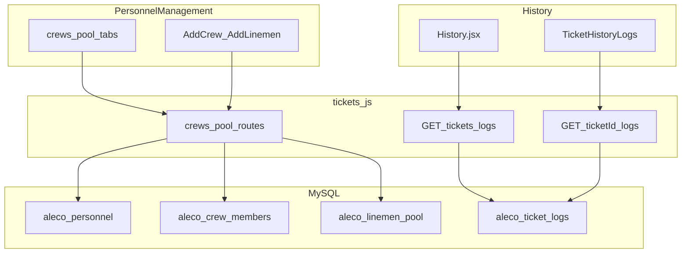

# Personnel & History — documentation

Read-only map of **Personnel Management** (crews + linemen pool) and **History Logs** (ticket audit trail).

---

## Personnel feature

### Purpose
Manage **crews** (`aleco_personnel` + `aleco_crew_members`) and the **linemen pool** (`aleco_linemen_pool`). Used for **dispatch** (crew name + crew phone for SMS), **inbound SMS** (crew resolved by `aleco_personnel.phone_number`), and dispatch modals that list crews.

### Entry points
| Layer | Location |
|-------|----------|
| Route | [`src/App.jsx`](../src/App.jsx) — `/admin-personnel` |
| Page | [`src/components/PersonnelManagement.jsx`](../src/components/PersonnelManagement.jsx) |
| Sidebar | [`src/components/Sidebar.jsx`](../src/components/Sidebar.jsx) |

### UI
- **Tabs:** Active Crews vs Linemen Pool.
- **Layouts:** grid / table / kanban via [`PersonnelLayoutPicker`](../src/components/personnels/PersonnelLayoutPicker.jsx).
- **Modals:** [`AddCrew`](../src/components/personnels/AddCrew.jsx), [`AddLinemen`](../src/components/personnels/AddLinemen.jsx).
- **HTTP:** `fetch` + [`apiUrl()`](../src/utils/api.js) — `GET /api/crews/list`, `GET /api/pool/list`; save uses `POST/PUT` on `/api/crews/*` and `/api/pool/*`; card actions also use `DELETE` for crews and pool entries.

### Backend (tickets brick)
Routes live in [`backend/routes/tickets.js`](../backend/routes/tickets.js) (not a separate router file).

| Method | Path | Summary |
|--------|------|---------|
| GET | `/api/crews/list` | Personnel + lead join to pool; memberships → `members`, `member_count`. Optional `?availableOnly=true`. |
| POST | `/api/crews/add` | Transaction: validate members, lead ∈ members, phone normalize; insert personnel + `aleco_crew_members`. |
| PUT | `/api/crews/update/:id` | Update crew; replace junction rows. |
| DELETE | `/api/crews/delete/:id` | Delete crew (expects FK cascade on members). Wired from Personnel card view. |
| GET | `/api/pool/list` | All linemen. |
| POST | `/api/pool/add` | Add lineman; phone normalized. |
| PUT | `/api/pool/update/:id` | Update lineman (incl. leave fields). |
| DELETE | `/api/pool/delete/:id` | Delete lineman if not in any crew and not a crew lead. |

**Phone:** [`backend/utils/phoneUtils.js`](../backend/utils/phoneUtils.js) `normalizePhoneForDB`.

---

## History feature

### Purpose
- **Admin History page** — paginated, filterable read of **`aleco_ticket_logs`**.
- **Per-ticket panel** — same table filtered by `ticket_id`.

Not login history, not interruptions; only **ticket lifecycle audit** (dispatch, status, hold, edit, delete, grouping, SMS-driven status, etc.).

### Entry points
| Layer | Location |
|-------|----------|
| Route | [`src/App.jsx`](../src/App.jsx) — `/admin-history` → [`History.jsx`](../src/components/History.jsx) |
| Per-ticket | [`TicketHistoryLogs.jsx`](../src/components/tickets/TicketHistoryLogs.jsx) |

### Admin History API usage
- **`GET /api/tickets/logs`** — query: `ticketId`, `actor_email`, `startDate`, `endDate`, `limit` (default 50, max 200), `offset`.
- Response: `{ success, data, total }`; `metadata` JSON parsed for display.

### Per-ticket API
- **`GET /api/tickets/:ticketId/logs`** — ordered by `created_at` DESC.

**Route order:** `GET /tickets/logs` is registered **before** `GET /tickets/:ticketId/logs` in [`tickets.js`](../backend/routes/tickets.js) so `logs` is not treated as a ticket id.

### Writers
[`backend/utils/ticketLogHelper.js`](../backend/utils/ticketLogHelper.js) `insertTicketLog` — used from [`tickets.js`](../backend/routes/tickets.js) and [`ticket-grouping.js`](../backend/routes/ticket-grouping.js).

---

## Visual

---

## Related documentation

- [Ticket flow & mount order](./TICKET_FLOW_SCAN.md)
- [Backend & server flow](./BACKEND_SERVER_FLOW.md)
