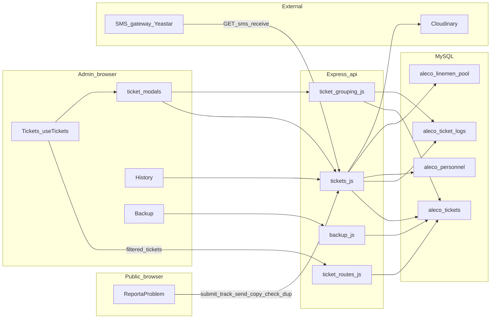
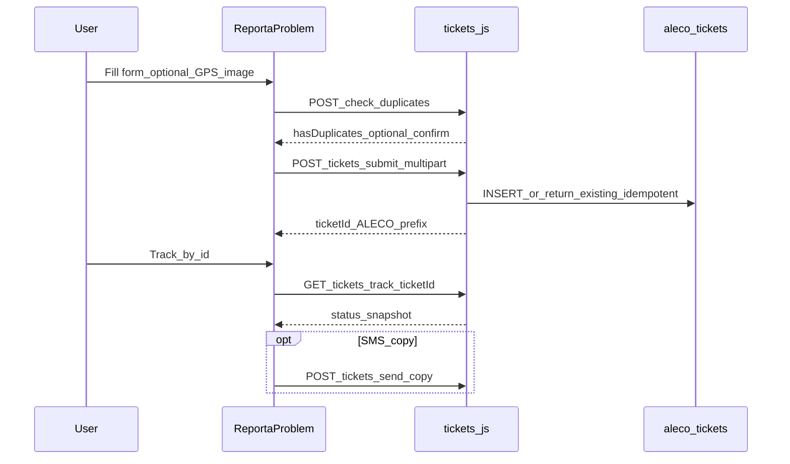
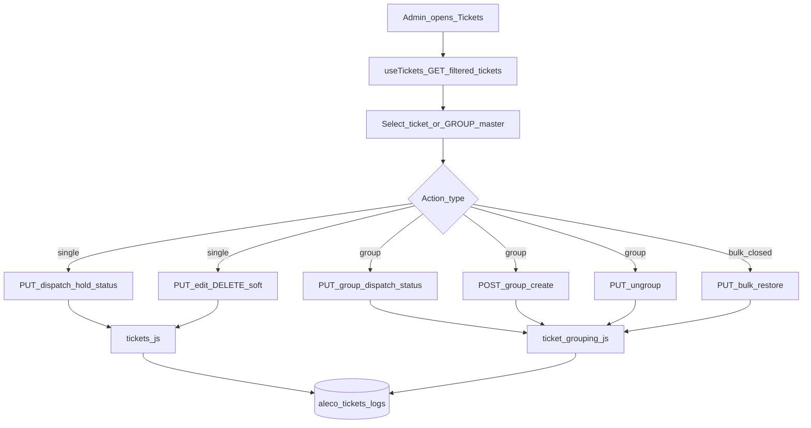

# Full ticket flow — scan summary and visuals

Read-only architecture map of the ticket feature. Reflects the Lego-brick layout in [`server.js`](../server.js): **`backupRoutes` is mounted before `ticketRoutes`** so `/tickets/export`, `/tickets/archive`, and `/tickets/import` are not captured by dynamic `/tickets/:ticketId`-style routes.

---

## Modular map (what each slice owns)

| Module | Primary files | Role in ticket flow |
|--------|---------------|---------------------|
| **A. Public intake** | [`src/ReportaProblem.jsx`](../src/ReportaProblem.jsx) | Form → `POST /api/tickets/submit` (multipart + optional image); pre-submit `POST /api/check-duplicates`; track `GET /api/tickets/track/:ticketId`; `POST /api/tickets/send-copy` for SMS copy of ticket id. |
| **B. Ticket lifecycle brick** | [`backend/routes/tickets.js`](../backend/routes/tickets.js) | Submit (idempotency window, Cloudinary, `ALECO-` id), `PUT /api/tickets/:ticketId`, soft delete `DELETE /api/tickets/:ticketId`, `PUT .../dispatch`, `PUT .../hold`, `PUT .../status` (+ legacy `PUT /:ticketId/status`), logs `GET /api/tickets/logs` and `GET /api/tickets/:ticketId/logs`, crews/pool CRUD under `/api/crews/*` and `/api/pool/*`. |
| **C. Filter brick** | [`backend/routes/ticket-routes.js`](../backend/routes/ticket-routes.js) | `GET /api/filtered-tickets` — admin dashboard query (tabs, group visibility, soft-delete rules, search across children of `GROUP-*`). |
| **D. Grouping brick** | [`backend/routes/ticket-grouping.js`](../backend/routes/ticket-grouping.js) | `POST /api/tickets/group/create`, `GET /api/tickets/groups`, `GET /api/tickets/group/:mainTicketId`, `PUT .../ungroup`, `PUT .../dispatch`, `PUT .../status`, `PUT /api/tickets/bulk/restore`. |
| **E. Admin UI orchestration** | [`src/components/Tickets.jsx`](../src/components/Tickets.jsx) + [`src/utils/useTickets.js`](../src/utils/useTickets.js) | `useTickets` → axios `GET /api/filtered-tickets` with filter state; `Tickets.jsx` wires group create/ungroup/dispatch/status, single-ticket dispatch/hold/delete/status, bulk restore; detail/group fetches from grouping routes; modals under `src/components/tickets/*`. |
| **F. Detail / history UX** | [`src/components/tickets/TicketDetailPane.jsx`](../src/components/tickets/TicketDetailPane.jsx), [`TicketHistoryLogs.jsx`](../src/components/tickets/TicketHistoryLogs.jsx), [`src/components/History.jsx`](../src/components/History.jsx) | Group detail `GET /api/tickets/group/:id`; per-ticket logs `GET /api/tickets/:ticketId/logs`; global log view `GET /api/tickets/logs?...`. |
| **G. Backup / data movement** | [`backend/routes/backup.js`](../backend/routes/backup.js), [`src/components/Backup.jsx`](../src/components/Backup.jsx) | Export preview/download, archive, import — ticket rows and related audit trail (backup brick mounted **before** tickets brick). |
| **H. SMS lane** | [`backend/routes/tickets.js`](../backend/routes/tickets.js) — `GET /api/tickets/sms/receive` | Yeastar-style query webhook: keywords, crew resolution by phone, status/hold/enroute/bulk patterns, `aleco_ticket_logs` via helper. See [Appendix A](#appendix-a-deferred-sms-webhook-audit-checklist). |
| **I. Utilities** | [`backend/utils/ticketLogHelper.js`](../backend/utils/ticketLogHelper.js), [`phoneUtils.js`](../backend/utils/phoneUtils.js), [`sms.js`](../backend/utils/sms.js) | Logging and phone normalization for HTTP admin actions and SMS parsing. |

**Data anchor:** Business identity is **`ticket_id`** (e.g. `ALECO-*`, `GROUP-*`); grouping uses **`parent_ticket_id`**. Filter logic treats `GROUP-*` masters vs children in [`ticket-routes.js`](../backend/routes/ticket-routes.js).

---

## Visual 1 — High-level flow (actors and bricks)

---

## Visual 2 — Consumer ticket journey (sequence)

---

## Visual 3 — Admin ticket operations (group vs single)

---

## How this scan was produced

- Enumerated HTTP surface on `tickets.js`, `ticket-grouping.js`, `ticket-routes.js`, and `backup.js`.
- Cross-linked frontend call sites in `ReportaProblem.jsx`, `Tickets.jsx`, `useTickets.js`, `History.jsx`, `Backup.jsx`, and ticket components using `/api/tickets/*` and `/api/filtered-tickets`.
- Confirmed **mount order** in `server.js` for export/archive/import precedence.

---

## Related documentation

- [Docs index](./README.md)
- [Backend & server flow](./BACKEND_SERVER_FLOW.md)
- [Data Management](./DATA_MANAGEMENT_SCAN.md)
- [Users & auth](./USER_AUTH_SCAN.md)
- [Personnel & history](./PERSONNEL_HISTORY_SCAN.md)
- [Location, phone, SMS & API routes](./LOCATION_PHONE_SMS_API_SCAN.md)

---

## Appendix A — Deferred SMS webhook audit (checklist)

Use this when you are ready to harden or debug inbound SMS (not required for the ticket flow scan itself).

| Area | What to verify |
|------|----------------|
| **Gateway contract** | Yeastar (or provider) query param names: `number`/`sender`, `text`/`content`; HTTPS vs HTTP; encoding of special characters. |
| **Phone match** | `normalizePhoneForDB` aligns with how `aleco_personnel.phone_number` is stored; crew rows exist for field phones. |
| **Ticket resolution** | “Latest Ongoing for crew” vs explicit `ALECO-` / `GROUP-` in message; edge cases when multiple ongoing or none. |
| **GROUP vs children** | Bulk `all fixed` / group branches update master + children consistently; compare with admin `ticket-grouping` behavior. |
| **Keywords & regex** | All branches (fixed, unfixed, nofault, hold, enroute, etc.) tested with real message samples; case and spacing. |
| **Logging** | Every automated status change writes `aleco_ticket_logs` with correct `actor_type` and metadata. |
| **Outbound SMS** | If `sms.js` sends consumer/crew notifications, confirm env (`PHILSMS_*` or equivalent) and failure handling (separate from inbound webhook). |

**Entry point:** `GET /api/tickets/sms/receive` in [`backend/routes/tickets.js`](../backend/routes/tickets.js).
