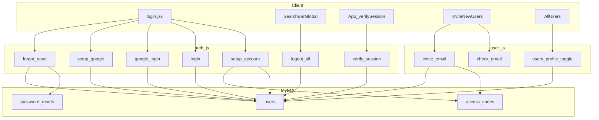

# Users & authentication — documentation

Map of **identity** (`auth.js`), **directory / admin user ops** (`user.js`), and the **login / session** UI.

---

## Lego bricks

| Brick | File | Responsibility |
|-------|------|----------------|
| Identity | [`backend/routes/auth.js`](../backend/routes/auth.js) | Registration, password + Google login, forgot/reset password, logout-all, verify-session |
| Directory | [`backend/routes/user.js`](../backend/routes/user.js) | Invite, email, check-email, list users, profile name, toggle Active/Disabled |
| Auth UI | [`src/components/buttons/login.jsx`](../src/components/buttons/login.jsx) | Modal: login, first-time setup, Google, forgot password |
| Session guard | [`src/App.jsx`](../src/App.jsx) | On route change, `POST /api/verify-session` if `userEmail` in localStorage |
| Google shell | [`src/main.jsx`](../src/main.jsx) | `GoogleOAuthProvider` + `VITE_GOOGLE_CLIENT_ID` |
| Admin axios | [`src/api/axiosConfig.js`](../src/api/axiosConfig.js) | `baseURL` = `VITE_API_URL` + global loader interceptors |
| User admin UI | [`src/components/Users.jsx`](../src/components/Users.jsx) | `InviteNewUsers` + `AllUsers` + `refreshKey` |
| Logout | [`src/components/searchBars/SearchBarGlobal.jsx`](../src/components/searchBars/SearchBarGlobal.jsx) | Optional logout-all → `POST /api/logout-all` then `localStorage.clear()` |

---

## Data model

- **`users`** — email, password (bcrypt), role, status (`Active`/`Disabled`), `auth_method`, `profile_pic`, **`token_version`**.
- **`access_codes`** — pending invites; `status` `pending` → `used`.
- **`password_resets`** — per-email token, `expires_at` (15 min); replaced idempotently on new forgot-password.

---

## Auth API (`/api` + auth routes)

| Method | Path | Role |
|--------|------|------|
| POST | `/api/setup-account` | Invite + password registration |
| POST | `/api/login` | Password login; returns `tokenVersion` |
| POST | `/api/google-login` | Existing Google user; updates pic/name |
| POST | `/api/setup-google-account` | New Google user + invite |
| POST | `/api/logout-all` | Increment `token_version` |
| POST | `/api/forgot-password` | Email reset code |
| POST | `/api/reset-password` | New password + bump `token_version` |
| POST | `/api/verify-session` | Compare client `tokenVersion` to DB |

## User admin API (`user.js`)

| Method | Path | Role |
|--------|------|------|
| POST | `/api/check-email` | `registered` / `pending` / `new` |
| POST | `/api/invite` | Create or update invite / role |
| POST | `/api/send-email` | Send code to invitee |
| GET | `/api/users` | List users (AllUsers) |
| PUT | `/api/users/profile` | Update name by email |
| POST | `/api/users/toggle-status` | Active ↔ Disabled |

---

## Session model

- **No JWT / no httpOnly API cookie** — client stores `userEmail`, `userName`, `userRole`, `tokenVersion`, etc. in **localStorage**.
- **Invalidation:** password reset and **logout-all** increment `token_version`; **`verify-session`** returns `invalid` if versions differ → [`App.jsx`](../src/App.jsx) clears storage and redirects `/`.
- **Operational:** `VITE_API_URL` must target **Express** (e.g. `http://localhost:5000`). Google needs `VITE_GOOGLE_CLIENT_ID` + authorized JS origins.

---

## Visual

---

## Related documentation

- [Backend & server flow](./BACKEND_SERVER_FLOW.md)
- [Ticket flow](./TICKET_FLOW_SCAN.md)
